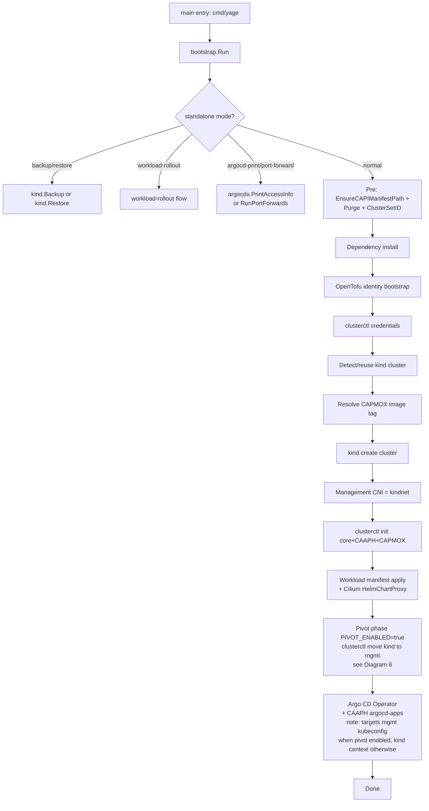
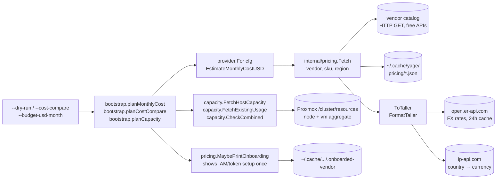
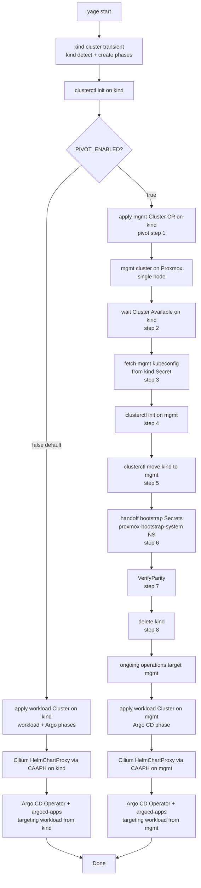
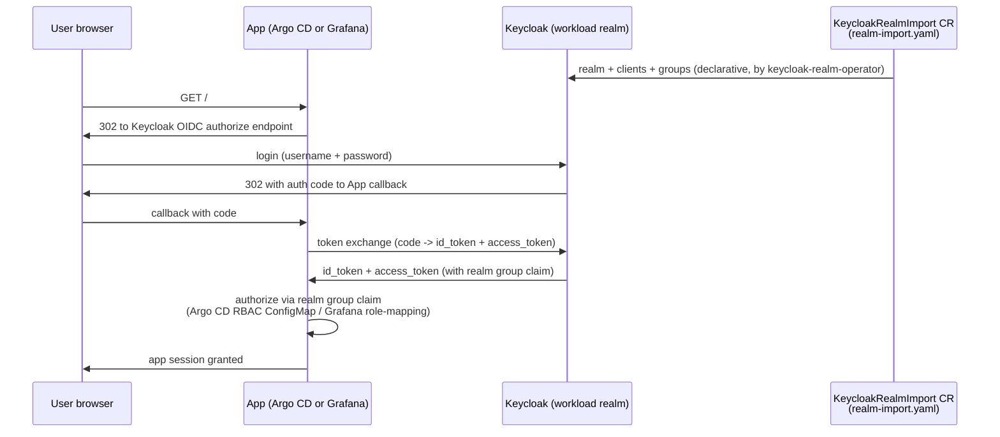
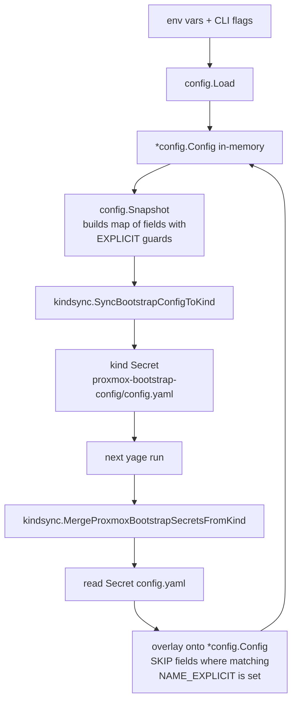

# yage — Go Architecture

The Go binary lives in `cmd/yage` and dispatches to
`internal/orchestrator.Run`.

## High-level overview

`yage` provisions a Cluster API management plane (in a local kind
cluster) and brings up a workload cluster on top of it across any of
twelve registered providers (Proxmox is the most-wired path; the
other providers vary in surface coverage). It layers in a CNI
(Cilium), a CSI (per-provider),
and a GitOps app-of-apps surface (Argo CD on the workload, fed by
CAAPH HelmChartProxy from the management cluster). The Go code is
organised as one orchestrator package and a dozen-plus focused leaf
packages:

- `internal/orchestrator` — drives the bootstrap phases and the
  standalone modes (`--workload-rollout`, `--argocd-print-access`,
  `--argocd-port-forward`, kind backup/restore).
- `internal/platform/k8sclient` — the foundation. Wraps `client-go` and dynamic clients
  keyed by kubecontext / kubeconfig file. Every package that talks to a
  cluster goes through it.
- `internal/config` — typed `Config` struct, `Load()` from env+CLI,
  plus `Snapshot`/state for round-tripping into a kind Secret.
- `internal/cluster/kindsync` — owns the `proxmox-bootstrap-config/config.yaml` Secret
  inside the kind cluster: write-out, read-back, and merge-in (skipping CLI-
  locked `*_EXPLICIT` fields).
- `internal/platform/installer` — installs all client binaries (kubectl, kind,
  clusterctl, cilium-cli, argocd-cli, cmctl, kyverno-cli, opentofu, docker
  upgrade) and conditionally builds arm64 controller images.
- `internal/cluster/kind` — kind cluster lifecycle: create, backup, restore, kubeconfig
  export.
- `internal/platform/opentofux` — OpenTofu wrapper. Generates the BPG provider tree,
  applies/recreates the Proxmox identity stack (CAPI + CSI users, tokens,
  ACLs), pulls outputs back into clusterctl + CSI configs.
- `internal/provider/proxmox/pveapi` — Proxmox API client (admin +
  clusterctl tokens), identity-suffix derivation, region/node
  resolution, cluster-set ID validation. Lives under the proxmox
  provider package because it's Proxmox-specific.
- `internal/capi/manifest` — generates the workload `clusterctl generate
  cluster` manifest, then patches it (CSI topology labels, kube-proxy skip
  for Cilium, ProxmoxMachineTemplate spec rev, CAAPH cluster labels).
- `internal/capi/caaph` — CAAPH HelmChartProxy authoring and waiters: Cilium HCP
  for the workload, Cilium L2 announcements / LB IP pool, Argo CD Operator
  install on the workload, ArgoCD CR + CAAPH `argocd-apps` HelmChartProxy
  (root Application of the user's Git app-of-apps).
- `internal/capi/argocd` — Argo CD UX: `--argocd-print-access`,
  `--argocd-port-forward`, kubeconfig discovery for standalone modes,
  pre-installed `argocd-redis` Secret on the workload.
- `internal/capi/csi` — Proxmox CSI helpers: load vars, push the
  `*-proxmox-csi-config` Secret into the workload.
- `internal/capi/cilium` — Cilium values rendering / arch detection.
- `internal/platform/kubectl` — typed-client wrappers for the few residual
  `kubectl`-like operations (apply, wait-for-endpoints, context resolution,
  workload-manifest apply with retries).
- `internal/capi/wlargocd` / `internal/capi/postsync` — workload Argo CD post-sync
  helpers (used by `--workload-rollout`).
- `internal/capi/helmvalues` — typed value-overlay generation.
- `internal/ui/cli` — flag parsing layer that hands a `*Config` back to
  `Run()`.
- `internal/provider` — pluggable CAPI infrastructure-provider interface +
  registry. 12 providers registered, each cross-checked against the upstream
  CAPI provider list at https://cluster-api.sigs.k8s.io/reference/providers:
  aws, azure, gcp, hetzner, proxmox, vsphere, openstack, docker (capd),
  digitalocean, linode, oci, ibmcloud. Each provider package self-registers
  in `init()` and supplies the per-cloud bits (clusterctl init args, K3s
  template, identity bootstrap, CSI Secret, cost estimator).
  `provider.MinStub` is the embed-helper for cost-only providers: defaults
  Capacity / EnsureIdentity / EnsureGroup / EnsureCSISecret to
  ErrNotApplicable, K3sTemplate to ErrNotApplicable, PatchManifest to a
  no-op. See `docs/providers.md`.
- `internal/pricing` — live FinOps pricing fetchers, one per vendor with a
  public catalog API (AWS Bulk JSON, Azure Retail Prices, GCP Cloud Billing
  Catalog, Hetzner, DigitalOcean, Linode, OCI, IBM Cloud Global Catalog).
  File-backed 24h cache at
  `~/.cache/yage/pricing/`. No hardcoded $/hour or $/GB-month
  numbers anywhere — when a vendor API is unreachable, callers receive
  `ErrUnavailable` and the cost path surfaces "estimate unavailable" rather
  than a stale figure. Also hosts the **taller** currency abstraction:
  geo-detect via ip-api.com → ISO country → currency, override via
  `YAGE_TALLER_CURRENCY`, FX from open.er-api.com (24h disk
  cache). And per-vendor IAM/token onboarding hints with sentinel-based
  first-run-only display. See `docs/cost-and-pricing.md`.
- `internal/cost` — multi-cloud comparator. `--cost-compare` runs every
  registered provider's `EstimateMonthlyCostUSD` against the same logical
  cluster shape and prints a side-by-side table (sorted by total).
  `--budget-usd-month N` adds a per-cloud retention column (how much
  persistent storage your budget buys after compute).
- `internal/cluster/capacity` — host-capacity preflight. Queries Proxmox's
  `/cluster/resources` for both node totals (CPU/mem/storage) and
  existing-VM census (sum of every qemu VM's declared max{cpu,mem,disk}).
  `CheckCombined(plan, host, existing, soft, tolerance)` returns a
  trichotomy verdict — fits / tight / abort — that drives both the
  dry-run plan and the real-run preflight. See `docs/capacity-preflight.md`.
- `internal/platform/shell` / `internal/ui/logx` / `internal/ui/promptx` / `internal/platform/sysinfo`
  / `internal/util/versionx` / `internal/util/yamlx` — small support utilities (process
  exec, structured logging, prompts, OS/arch detection, semver parsing, YAML
  field extraction).

## Phase timeline (diagram 1)



## Internal package dependency graph (diagram 2)

```mermaid
flowchart LR
    subgraph orchestrator[Orchestrator]
        orchestrator[internal/orchestrator]
    end

    subgraph midtier[Mid-tier]
        caaph[internal/capi/caaph]
        manifest[internal/capi/manifest]
        kindsync[internal/cluster/kindsync]
        argocd[internal/capi/argocd]
        csi[internal/capi/csi]
        kindp[internal/cluster/kind]
        installer[internal/platform/installer]
        opentofux[internal/platform/opentofux]
    end

    subgraph leaves[Leaves]
        configp[internal/config]
        logx[internal/ui/logx]
        shell[internal/platform/shell]
        sysinfo[internal/platform/sysinfo]
        versionx[internal/util/versionx]
        yamlx[internal/util/yamlx]
        proxmox[internal/provider/proxmox + pveapi]
        promptx[internal/ui/promptx]
        helmvalues[internal/capi/helmvalues]
        wlargocd[internal/capi/wlargocd]
        postsync[internal/capi/postsync]
        cilium[internal/capi/cilium]
        kubectl[internal/platform/kubectl]
        clip[internal/ui/cli]
    end

    foundation[internal/platform/k8sclient]

    bootstrap --> caaph
    bootstrap --> capimanifest
    bootstrap --> kindsync
    bootstrap --> argocdx
    bootstrap --> csix
    bootstrap --> kindp
    bootstrap --> installer
    bootstrap --> opentofux
    bootstrap --> kubectlx
    bootstrap --> proxmox
    bootstrap --> configp
    bootstrap --> shell
    bootstrap --> logx
    bootstrap --> promptx
    bootstrap --> yamlx
    bootstrap --> helmvalues
    bootstrap --> wlargocd
    bootstrap --> postsync
    bootstrap --> foundation

    caaph --> ciliumx
    caaph --> proxmox
    caaph --> sysinfo
    caaph --> shell
    caaph --> configp
    caaph --> logx
    caaph --> foundation

    capimanifest --> ciliumx
    capimanifest --> proxmox
    capimanifest --> sysinfo
    capimanifest --> configp
    capimanifest --> logx
    capimanifest --> foundation

    kindsync --> proxmox
    kindsync --> kubectlx
    kindsync --> shell
    kindsync --> configp
    kindsync --> logx
    kindsync --> foundation

    argocdx --> sysinfo
    argocdx --> configp
    argocdx --> logx
    argocdx --> foundation

    csix --> configp
    csix --> logx
    csix --> foundation

    kindp --> shell
    kindp --> configp
    kindp --> logx

    installer --> versionx
    installer --> sysinfo
    installer --> shell
    installer --> configp
    installer --> logx

    opentofux --> capimanifest
    opentofux --> csix
    opentofux --> kindsync
    opentofux --> proxmox
    opentofux --> sysinfo
    opentofux --> shell
    opentofux --> configp
    opentofux --> logx

    kubectlx --> configp
    kubectlx --> logx
    kubectlx --> foundation

    proxmox --> sysinfo
    proxmox --> configp
    proxmox --> logx

    wlargocd --> postsync
    wlargocd --> configp
    wlargocd --> logx

    postsync --> shell
    postsync --> configp

    ciliumx --> sysinfo
    ciliumx --> configp
    ciliumx --> logx

    helmvalues --> configp
    clip --> configp
    clip --> logx
```

## Install topology (diagram 3)

```mermaid
flowchart TD
    BC[yage binary] --> KCB[host binaries: kubectl, kind,<br/>clusterctl, cilium-cli, argocd-cli,<br/>cmctl, kyverno-cli, opentofu]
    BC --> KIND[kind cluster: management plane]
    BC --> TF[OpenTofu / BPG provider:<br/>Proxmox CAPI + CSI users,<br/>tokens, ACLs]
    BC --> CCI[clusterctl init: CAPI core,<br/>kubeadm bootstrap, kubeadm<br/>control-plane, CAAPH addon,<br/>in-cluster IPAM, CAPMOX]
    BC --> WCR[Workload Cluster CR<br/>+ ProxmoxCluster + KubeadmCP]
    BC --> CHCP[Cilium HelmChartProxy<br/>on management]
    BC --> CSEC[CSI config Secret<br/>on workload]
    BC --> RSEC[argocd-redis Secret<br/>on workload]
    BC --> AOP[ArgoCD CR + Argo CD Operator<br/>kustomize apply on workload]
    BC --> AHCP[CAAPH argocd-apps HelmChartProxy<br/>root Application=WORKLOAD_CLUSTER_NAME]

    CHCP -- CAAPH reconciles --> CILW[Cilium chart on workload]
    AHCP -- CAAPH reconciles --> ARGOAPPS[argocd-apps Helm chart<br/>= root Application of-apps]

    ARGOAPPS -- kustomize-build --> GIT[~/Devel/workload-app-of-apps Git repo]
    GIT --> CHILD[Child Argo Applications]

    CHILD --> MS[metrics-server wave -3]
    CHILD --> SCRDS[spire-crds wave -3]
    CHILD --> PCSI[proxmox-csi wave -2]
    CHILD --> KYV[kyverno wave 0]
    CHILD --> CM[cert-manager wave 0]
    CHILD --> CP[crossplane wave 2]
    CHILD --> CNPG[cnpg wave 2]
    CHILD --> ES[external-secrets wave 3]
    CHILD --> INF[infisical wave 4]
    CHILD --> SP[spire wave 5]
    CHILD --> VMG[victoriametrics + otel + grafana wave 6]
    CHILD --> BS[backstage wave 7 opt-in]
    CHILD --> KC[keycloak wave 8]
    CHILD --> KCRO[keycloak-realm-operator wave 9 opt-in]
    CHILD --> KCR[keycloak-realm wave 10]
    CHILD --> SSO[argocd-sso wave 11]

    MS --> MS_SRC[helm/oci source]
    SCRDS --> SCRDS_SRC[helm/oci source]
    PCSI --> PCSI_SRC[helm/oci source]
    KYV --> KYV_SRC[helm/oci source]
    CM --> CM_SRC[helm/oci source]
    CP --> CP_SRC[helm/oci source]
    CNPG --> CNPG_SRC[helm/oci source]
    ES --> ES_SRC[helm/oci source]
    INF --> INF_SRC[helm/oci source]
    SP --> SP_SRC[helm/oci source]
    VMG --> VMG_SRC[helm/oci sources]
    BS --> BS_SRC[helm/oci source]
    KC --> KC_SRC[helm/oci source]
    KCRO --> KCRO_SRC[helm/oci source]
    KCR --> KCR_SRC[kustomize manifest]
    SSO --> SSO_SRC[kustomize manifest]
```



## Cost / pricing / capacity subsystem

Three cooperating packages turn `--dry-run` and `--cost-compare` into
useful planning signals without provisioning anything:



Three independent invariants:

- **No hardcoded money numbers.** Every `$/hour`, `$/month`, `$/GB-mo`
  comes from a live API call. When the API is unreachable, the cost
  path returns `ErrUnavailable` (wrapped in `ErrNotApplicable`) and
  the dry-run shows "estimate unavailable: <specific reason>"
  instead of fabricating a number.
- **No hardcoded display currency.** All amounts pass through
  `pricing.FormatTaller` which converts via live FX into the
  geo-detected (or operator-overridden) local currency.
- **No silent overcommit.** Capacity preflight folds in the existing
  VMs already on the host, not just the planned cluster. The
  trichotomy verdict (fits / tight / abort) is honest about both
  soft-budget and hard-ceiling boundaries.

See `docs/cost-and-pricing.md` and `docs/capacity-preflight.md` for
the user-facing flag/env reference.

## Bootstrap-and-pivot pattern

The kind cluster that hosts CAPI during the kind-detection through workload
manifest apply phases is intentionally ephemeral: it is single-host, runs on
Docker on the operator's workstation, and is not the production management
plane. Treating it as the long-lived CAPI host is fragile — the workstation
reboots, Docker upgrades, kind versions, and local kubeconfigs all become
operational surface area for a control plane that should be cluster-grade.
The bootstrap-and-pivot pattern resolves this by using kind only as a "boot
loader": kind brings up enough CAPI to provision a single-node "management
cluster" on Proxmox, and that mgmt cluster then takes over CAPI duties for
the rest of the lifecycle.

When `PIVOT_ENABLED=true`, kind becomes transient. After the management
cluster comes up on Proxmox and reports the CAPI Cluster as Available, the
canonical `clusterctl move` machinery copies all CAPI custom resources
(Clusters, Machines, KubeadmControlPlanes, ProxmoxClusters, MachineDeployments,
identity Secrets, …) from the kind management plane to the new Proxmox-hosted
management cluster, and the kind cluster is torn down. Subsequent workload
clusters are then provisioned by applying their Cluster CRs against the
mgmt kubeconfig instead of the kind context, and Argo CD targeting in the
final phase follows the same flip. When `PIVOT_ENABLED=false` (the default),
kind remains the management plane and workload Cluster CRs are applied to
it directly.

The eight pivot steps, with their Go entry points in the
`internal/capi/pivot/` package:

1. **EnsureManagementCluster** — provision the single-node mgmt cluster on
   Proxmox via the existing CAPMOX path on kind (`internal/capi/pivot/pivot.go`).
2. **Wait for the CAPI Cluster to report Available on kind**
   (`internal/capi/pivot/wait.go`).
3. **Fetch the mgmt kubeconfig** from the kind-side
   `<mgmt-cluster>-kubeconfig` Secret and persist it locally
   (`internal/capi/pivot/wait.go`).
4. **InstallCAPIOnManagement** — `clusterctl init` against the mgmt
   kubeconfig with the same providers (core, kubeadm bootstrap + control
   plane, CAAPH, in-cluster IPAM, CAPMOX) (`internal/capi/pivot/move.go`).
5. **MoveCAPIState** — `clusterctl move --to-kubeconfig <mgmt>` to
   transfer all CAPI CRs and identity Secrets from kind to mgmt
   (`internal/capi/pivot/move.go`).
6. **HandOffBootstrapSecretsToManagement** — re-create the
   `proxmox-bootstrap-config/config.yaml` Secret (and any sibling literal
   Secrets the bootstrap relies on) inside the new
   `proxmox-bootstrap-system` namespace on the mgmt cluster
   (`internal/cluster/kindsync/handoff.go`).
7. **VerifyParity** — compare the post-move set of CAPI CRs on mgmt
   against the pre-move snapshot from kind, and assert that controllers
   on mgmt are reconciling the moved Clusters
   (`internal/capi/pivot/pivot.go`).
8. **TeardownKind** — delete the kind cluster (skipped under
   `--no-delete-kind`) (`internal/capi/pivot/pivot.go`).

### Diagram 6: bootstrap-and-pivot timeline



## Keycloak SSO topology (diagram 4)



The realm CR is at
`~/Devel/workload-app-of-apps/base/addons/manifests/keycloak-realm/realm-import.yaml`,
applied as wave 10 by the `keycloak-realm` Application; the
`keycloak-realm-operator` (wave 9, opt-in) reconciles it into Keycloak.

## Persistence model

yage's persistence policy: **state lives in kind Secrets, not on
local disk.** Config, provider credentials, kindsync handoff data,
and OpenTofu identity outputs all round-trip through Secrets in
the `yage-system` namespace on the local kind cluster. The same
state is what the eventual pivot moves to a managed cluster.

Local disk is used only for **encrypted kind cluster backup/restore
archives** (`--kind-backup` writes a tar.gz; `--kind-restore` reads
one), and even those default to passphrase-encrypted on creation.

The implication for tooling: yage is reproducible across machines
as long as the operator can re-create the kind cluster — there are
no `~/.yage/*` config files to copy, no per-host state. Run history
is in the kind cluster's Secrets; run output is in your shell.

## Config flow / kind-Secret persistence (diagram 5)



## In-depth Run() walk-through

The numbered steps reference `internal/orchestrator/bootstrap.go`.

1. **Defaults** — fall back `KindClusterName` to `ClusterName` or
   `capi-provisioner`; default `AllowedNodes` to `ProxmoxNode`.
2. **Standalone kind backup/restore** — invoke
   `installer.Kubectl` then `kind.Backup` / `kind.Restore` and exit.
3. **Standalone `--workload-rollout`** — merge kind Secrets,
   resolve management context, optionally regenerate the CAPI manifest and
   re-apply with retries (3 attempts, 10s sleep). Argo branch logs guidance
   (no automatic sync).
4. **Standalone Argo print/port-forward** — discover workload
   kubeconfig and call `argocdx.PrintAccessInfo` /
   `argocdx.RunPortForwards`.
5. **Pre-phase** — `EnsureCAPIManifestPath`, optional
   `PurgeGeneratedArtifacts`, derive `ClusterSetID` and Proxmox identity
   suffix.
6. **Dependency install** — `installer.SystemDependencies`,
   `installer.Docker`, two-pass `installer.Kubectl` (the second pass picks
   up a pinned `ClusterctlVersion` that the first kind-Secret merge may
   have introduced), `installer.Kind`, `installer.Clusterctl`,
   `installer.CiliumCLI`, optional `ArgoCDCLI`/`KyvernoCLI`/`Cmctl`,
   conditional Docker upgrade + BPG provider install (skipped on
   `--no-delete-kind` or when reusing a kind cluster without `--force`),
   `installer.OpenTofu`, `EnsureKindConfig`.
7. **OpenTofu identity bootstrap** — if neither env nor an
   explicit local clusterctl file satisfies CAPI/CSI creds, call
   `opentofux.WriteClusterctlConfigIfMissing` /
   `WriteCSIConfigIfMissing`, and as a last resort run
   `opentofux.ApplyIdentity` (or `RecreateIdentities` under
   `--recreate-proxmox-identities`). Outputs are written back to the
   clusterctl + CSI config files.
8. **clusterctl credentials** — interactive prompt fallback,
   pull `PROXMOX_URL`/`TOKEN`/`SECRET` from local clusterctl file,
   normalise + validate the token secret, refresh derived token IDs,
   verify connectivity via
   `proxmox.ResolveRegionAndNodeFromClusterctlAPI`. Then write the
   ephemeral clusterctl config via `SyncClusterctlConfigFile`.
9. **kind detection** — list kind clusters; under
   `--force` (and not `--no-delete-kind`) delete-then-recreate, else reuse
   and set `kindClusterReused`.
10. **CAPMOX image tag** — use pinned
    `cfg.CAPMOXVersion` or git-clone the CAPMOX repo and pick the latest
    `vX.Y.Z` tag.
11. **kind create + image load** — `kind create
    cluster --config <kind.yaml>` (skipped on reuse), merge kubeconfig,
    `installer.BuildIfNoArm64` for CAPMOX + CAPI core/bootstrap/control-
    plane + IPAM (skipped on reuse), then sync config + literal creds back
    into the kind Secret.
12. **management CNI** — kindnet only; no Cilium on
    the management plane.
13. **clusterctl init** —
    `InstallMetricsServerOnKindManagement`, then `clusterctl init` with
    `infrastructure=proxmox` + `ipam=in-cluster` + `addon=helm`. Wait for
    CAAPH (`caaph-system`), `capi-controller-manager`, kubeadm bootstrap +
    control-plane controllers, their webhook endpoints, and
    `capmox-controller-manager` + its webhook. End with
    `opentofux.RecreateResyncCapmox`.
14. **workload manifest apply** —
    `MaybeInteractiveSelectWorkloadCluster`,
    `capimanifest.TryFillWorkloadInputsFromManagement`, re-merge kind
    Secrets, `TryLoadCAPIManifestFromSecret`,
    `capimanifest.GenerateWorkloadManifestIfMissing`, patch chain
    (`PatchProxmoxCSITopologyLabels`, `PatchKubeadmSkipKubeProxyForCilium`,
    `PatchProxmoxMachineTemplateSpecRevisions`,
    `DiscoverWorkloadClusterIdentity`, `EnsureWorkloadClusterLabel`,
    `RefreshDerivedCiliumClusterID`, `caaph.PatchClusterCAAPHHelmLabels`),
    `PushCAPIManifestToSecret`, then
    `kubectlx.ApplyWorkloadManifestToManagementCluster` with up to 3
    attempts. Then `opentofux.RecreateIdentitiesWorkloadCSISecrets`,
    `caaph.ApplyWorkloadCiliumHelmChartProxy`,
    `WaitForWorkloadClusterReady`,
    `caaph.ApplyWorkloadCiliumLBBToWorkload` (L2 announcements + LB IP
    pool), conditional `InstallMetricsServerOnWorkload`,
    `csix.ApplyConfigSecretToWorkload`, and
    `argocdx.ApplyRedisSecretToWorkload`.
15. **Argo CD on workload** — when
    `WorkloadArgoCDEnabled`, `caaph.ApplyWorkloadArgoHelmProxies` (passing
    `caaph.ApplyWorkloadArgoCDOperatorAndCR` as the post-prepare hook),
    `caaph.WaitWorkloadArgoCDServer`, `caaph.LogWorkloadArgoAppsStatus`.
16. **Done** — log a hint about `kubectl get clusters -A` /
    `clusterctl describe cluster`.

## Library swap audit — remaining `kubectl` shell-outs

Counts produced from
`grep -rE 'shell\.(Run|Capture|Pipe).*"kubectl"|exec\.Command\("kubectl"' internal/ --include='*.go'`:

- `internal/platform/installer/installer.go:494` — `kubectl version -o json` for
  client `gitVersion` parsing during version-pin reconciliation; reads the
  on-disk `kubectl` binary the user already runs (cluster connection not
  required), so swapping to client-go would not represent the on-disk
  binary the user expects.
- `internal/capi/caaph/caaph.go:391` — `kubectl --kubeconfig <wk> apply -k <git
  ref> --server-side` for the Argo CD Operator. Reads a kustomize tree
  from a Git ref; replicating server-side `-k` would pull in
  `sigs.k8s.io/kustomize/api/krusty` (~10MB of deps). Comment in source
  notes the trade-off.
- `internal/cluster/kind/restore.go:294` — `kubectl --context <ctx> apply -f -` to
  pipe a re-hydrated namespace doc back during `--restore`. Streaming
  multi-document YAML through dynamic apply with field-management parity
  to `kubectl apply` is non-trivial; backup/restore is rarely run.
- `internal/cluster/kind/backup.go:163,169,188,337` — backup-side `kubectl get`
  and `kubectl api-resources` and `kubectl config get-contexts`, used to
  enumerate every namespaced resource type per namespace and dump them as
  JSON Lines. Same trade-off as restore.
- `internal/capi/argocd/argocdx.go:314` — long-lived `kubectl port-forward`
  for `--argocd-port-forward`. The port-forwarding behaviour with proper
  signal forwarding and re-connect is essentially what the kubectl
  subprocess provides; replacing it with a `client-go` portforwarder
  would re-implement the same UX. Function-level NOTE in the source
  records this rationale.

Everything else (deploy/Service/Secret/CRD apply, waits, Cluster CR
patch, kubeconfig discovery, Helm chart proxy authoring) goes through
`internal/platform/k8sclient` typed + dynamic clients.

Intentional `clusterctl` shell-outs (the binary is the supported entry
point for these operations and re-implementing them in-process would
fork upstream behaviour):

- `clusterctl init` — provider install on both the kind management plane
  (clusterctl init phase) and the Proxmox-hosted management cluster (pivot step 4).
- `clusterctl alpha rollout restart` — used by `--workload-rollout` to
  roll KubeadmControlPlane / MachineDeployment.
- `clusterctl move` — pivot step 5; transfers all CAPI CRs and identity
  Secrets from kind to the mgmt cluster when `PIVOT_ENABLED=true`. Reusing
  the upstream binary preserves the canonical move semantics (pause /
  copy / verify / unpause) rather than re-implementing them.

## Vendor library inventory

Pulled from `go.mod`. Direct + transitive libraries the binary now consumes
in-process to replace shell-outs:

- `k8s.io/client-go` v0.36.0 — typed Kubernetes clientset (Deployments,
  Services, Secrets, Namespaces, etc.), informers, and discovery.
- `k8s.io/api` v0.36.0 — typed API objects (CoreV1, AppsV1, NetworkingV1,
  …) used by the typed clientset.
- `k8s.io/apimachinery` v0.36.0 — `metav1`, schema/GVR/GVK, runtime
  serialisers, label selectors.
- `k8s.io/cli-runtime` v0.36.0 — `genericclioptions` and resource
  builders used by the apply paths in `internal/platform/kubectl`.
- `sigs.k8s.io/yaml` v1.6.0 — strict YAML round-trip used by `yamlx`,
  Snapshot, and manifest patching.
- `sigs.k8s.io/kind` v0.31.0 — pulled in for the kind config types used
  by `internal/cluster/kind` / `EnsureKindConfig`.
- `helm.sh/helm/v3` — _not yet a direct dep in go.mod_; CAAPH authoring
  is rendered through `internal/capi/helmvalues` + `sigs.k8s.io/yaml`
  rather than embedding helm. Listed here as a future swap target.
- `sigs.k8s.io/cluster-api` — _not yet a direct dep in go.mod_; Cluster
  / KubeadmControlPlane / MachineDeployment are still authored as YAML
  through `clusterctl generate cluster` and patched in
  `internal/capi/manifest`. Direct vendor would let
  `EnsureWorkloadClusterLabel` and friends use typed CAPI APIs instead
  of YAML edits.
- Support indirects worth flagging: `github.com/spf13/cobra` /
  `pflag` (CLI), `github.com/blang/semver/v4` (used by `versionx`),
  `sigs.k8s.io/kustomize/api` and `kyaml` (transitively, through
  cli-runtime).
