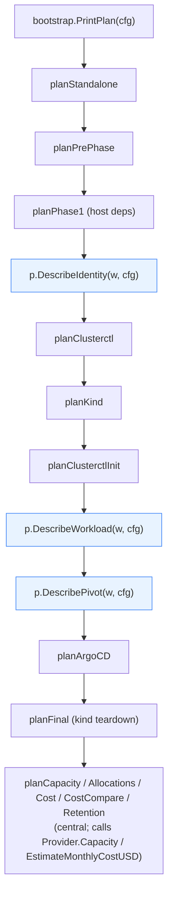

# Provider abstraction — analysis + plan

The pluggable `provider.Provider` interface (12 providers
registered today) covers the *peripheral* CAPI bits — clusterctl
init args, K3s template, identity bootstrap, CSI Secret, cost
estimator. The *core orchestration* still hardcodes Proxmox in
several places. This document maps the bindings and proposes a
phased extraction.

## 1. Where Proxmox is currently bound

Numbers below are reference counts as of HEAD. They're indicative,
not authoritative — the analysis is what matters.

### 1a. Hard bindings outside the proxmox provider package

| File                                      | Mentions | What it does                                                                 |
|-------------------------------------------|---------:|------------------------------------------------------------------------------|
| `internal/orchestrator/bootstrap.go`         | 129      | `Run()` orchestrator: identity, kind→mgmt sync, manifest patching, pivot     |
| `internal/orchestrator/plan.go`              |  34      | Dry-run plan body: identity / workload-cluster / pivot phases are written for Proxmox |
| `internal/orchestrator/admin.go`             |  35      | Proxmox admin-API helpers (pool create, etc.)                                |
| `internal/orchestrator/purge.go`             |  12      | `--purge` flow (Terraform state, BPG provider tree, CSI configs)             |
| `internal/orchestrator/workloadapps.go`      | (some)   | App-of-apps wiring                                                           |
| `internal/capi/pivot/{pivot,wait,move,manifest}.go` |  44 | clusterctl move: kind → Proxmox mgmt cluster                                 |
| `internal/cluster/kindsync/*`                     | 174      | The `proxmox-bootstrap-config/config.yaml` Secret, BPG cred handoff          |
| `internal/cluster/capacity/capacity.go`           | (whole)  | Hits Proxmox `/api2/json/cluster/resources` directly                         |
| `internal/capi/manifest/{k3s,patches}.go`  | (some)   | ProxmoxMachineTemplate-shaped patches; K3s template embeds Proxmox CRDs      |
| `internal/capi/wlargocd/render.go`             |  some    | App-of-apps overlay names                                                    |
| `internal/util/yamlx/yamlx.go`                 |  some    | YAML extraction helpers used by Proxmox patches                              |
| `internal/capi/caaph/caaph.go`                 |  some    | Helm values rendering for Proxmox CSI                                        |

### 1b. Config bindings

`internal/config/config.go`: **83 fields** prefixed `Proxmox*`
(URL, Token, Secret, AdminUsername, AdminToken, Node, Pool,
TemplateID, CSIStorage, CSIChartName, CAPIUserID, IdentitySuffix,
…). All read from `PROXMOX_*` env or `--proxmox-*` flags. Treated
as first-class top-level config rather than namespaced under a
provider.

### 1c. CLI bindings

`internal/ui/cli/parse.go` + `usage.txt`: dozens of `--proxmox-*` /
`--admin-*` flags presented as if they were universal program
flags. Other-cloud flags exist (`--aws-mode`, `--azure-location`,
…) but live alongside as peers. There is no `--infra-provider` /
`--infrastructure-provider` flag — the active provider is set only
via `INFRA_PROVIDER` env, which is itself surprising.

### 1d. Capacity bindings

`internal/cluster/capacity/capacity.go` directly calls Proxmox endpoints:
- `/api2/json/cluster/resources?type=node` — host totals
- `/api2/json/cluster/resources?type=storage` — storage backends
- `/api2/json/cluster/resources?type=vm` — existing-VM census

`bootstrap.go` and `plan.go` call `capacity.FetchHostCapacity` and
`capacity.FetchExistingUsage` directly — bypassing the
`Provider.Capacity` method that already exists on the interface.

### 1e. Identity bindings

`internal/platform/opentofux/` is purely Proxmox: it generates the BPG
Terraform tree, applies/recreates the CAPI + CSI users. The
`Provider.EnsureIdentity` interface method exists and the proxmox
provider's implementation correctly delegates here. AWS / Azure /
GCP / etc. would each need their own identity-bootstrap layer.

### 1f. Pivot bindings

`internal/capi/pivot/` runs `clusterctl move` from kind → a Proxmox-
hosted management cluster. The shape generalizes (kind → any
managed cluster) but the text and many details are Proxmox-flavored.

## 2. What's already abstracted

The `Provider` interface (`internal/provider/provider.go`) covers:

- `Name()`, `InfraProviderName()`
- `EnsureIdentity(cfg) error`
- `Capacity(cfg) (*HostCapacity, error)`
- `EnsureGroup(cfg, name) error`
- `ClusterctlInitArgs(cfg) []string`
- `K3sTemplate(cfg, mgmt) (string, error)`
- `PatchManifest(cfg, manifestPath, mgmt) error`
- `EnsureCSISecret(cfg, kubeconfigPath) error`
- `EstimateMonthlyCostUSD(cfg) (CostEstimate, error)`

The `provider.MinStub` helper short-circuits the boring bits for
cost-only providers.

What's **missing** from this interface relative to what `Run()`
actually does:

1. **Existing-resource census** (corollary to `Capacity`). Today
   `capacity.FetchExistingUsage` is Proxmox-only. Needs a
   `Provider.ExistingUsage(cfg) (*ExistingUsage, error)` — or fold
   into `Capacity`.
2. **Plan-section content**. The dry-run prints provider-specific
   text like "Proxmox templates: control-plane=104, worker=104" or
   "Cilium HCP …" or "Proxmox CSI on workload …". Should be
   delegated to `Provider.DescribePlan(w, cfg)` — each provider
   prints its own relevant sections.
3. **Kind→mgmt config persistence** (`kindsync`). Today the kind
   Secret is keyed `proxmox-bootstrap-config` and contains
   Proxmox-specific fields. Needs to be neutral (`bootstrap-config`
   namespace, generic schema) with a per-provider Secret extension.
4. **Purge** (`--purge`). Today purges Terraform state + Proxmox
   admin tree. Needs `Provider.Purge(cfg) error` for cloud-specific
   cleanups (e.g. AWS = delete the IAM stack we created in
   `EnsureIdentity`; Hetzner = no-op).
5. **Manifest generation**. `internal/capi/manifest` currently
   emits CAPI manifests assuming Proxmox-flavored variables. The
   per-provider `K3sTemplate` + `PatchManifest` already cover most
   of this; what remains is the *value substitution* (which env
   vars get plugged in) — generalize via `Provider.TemplateVars(cfg)
   map[string]string`.
6. **Admin/auth bootstrap helpers** (`bootstrap/admin.go`):
   pool/group/folder creation that runs against the cloud-control
   API. `Provider.EnsureGroup` already exists; the orchestrator
   just needs to delegate consistently.

## 3. Plan — phased extraction

Don't do this in one mega-PR. Five phases, each shippable:

### Phase A — Inventory behind the interface

**Goal:** kill the direct `capacity.Fetch*` calls in
`bootstrap.go` / `plan.go`. Provider becomes the single point of
truth for "what's there + what's free on this cloud" — and the
provider, not the orchestrator, owns the math that turns raw
capacity into cloud-correct available headroom.

Steps:

1. Replace the existing `Provider.Capacity` method with a single
   `Inventory` method (see §10 spec):
   ```go
   Inventory(cfg *config.Config) (*Inventory, error)
   ```
   Define `Inventory`, `ResourceTotals` in `internal/provider/`
   (or a shared sub-package to avoid import cycles).
2. Move `FetchHostCapacity` + `FetchExistingUsage` out of
   `internal/cluster/capacity` into `internal/provider/proxmox/` as
   private helpers. Combine them inside the proxmox provider's
   `Inventory()` — one outbound batch, returns Total + Used +
   Available (Proxmox computes Available = Total − Used; trivial
   for a flat pool).
3. Replace direct calls in `bootstrap.go` / `plan.go` with a
   single `provider.For(cfg).Inventory(...)`. Preflight checks
   `inv.Available`; plan output reads `inv.Total` and `inv.Used`.
4. Other providers return `ErrNotApplicable` from `Inventory`
   until each implements its own (AWS Service Quotas, GCP Compute
   Engine quotas, Hetzner per-project caps, etc.).

**Risk:** low. Mechanical refactor; existing tests still cover the
math.

**Estimated size:** ~400 LOC moved, ~50 LOC of new wiring.

### Phase B — Plan body delegation

**Goal:** kill the Proxmox-specific bullets in
`bootstrap/plan.go`. Each provider prints its own sections.

Steps:

1. Add to `Provider`:
   ```go
   DescribePlan(w PlanWriter, cfg *config.Config)
   ```
   `PlanWriter` is a small interface (just `Section(title string)` +
   `Bullet(format string, args ...any)` + `Skip(reason string)`)
   defined in `internal/orchestrator` or a sibling. Keeps the visual
   style consistent across providers.
2. `bootstrap.planForProvider(w, cfg)` calls
   `provider.For(cfg).DescribePlan(w, cfg)`.
3. Move the Proxmox-specific bullets into
   `internal/provider/proxmox/plan.go`. AWS gets its own
   `internal/provider/aws/plan.go` (currently it has none — and
   that's why `--dry-run` on AWS shows Proxmox phases today).
4. Cross-cutting sections that are provider-agnostic stay in
   `bootstrap/plan.go`: capacity verdict, allocations, cost,
   cost-compare, retention, taller note.

**Risk:** medium. Each provider needs to know what its phases
look like. AWS today has none — this phase is also where AWS
finally gets a real dry-run.

**Estimated size:** ~600 LOC redistributed (Proxmox-specific text
moves from `plan.go` into `provider/proxmox/plan.go`); ~250 LOC new
content per other provider that wants a real dry-run.

### Phase C — Config namespacing

**Goal:** `cfg.Proxmox*` becomes `cfg.Providers.Proxmox.*` (or
similar). Doesn't break env-var compatibility (`PROXMOX_*` still
works), but the in-process structure mirrors the abstraction.

Steps:

1. Move all 83 `Proxmox*` fields into a new struct
   `internal/config/proxmox.go`:
   ```go
   type ProxmoxConfig struct {
       URL string; AdminUsername string; … // 83 fields
   }
   ```
   exposed as `Config.Providers.Proxmox`.
2. Same for `cfg.AWSMode` / `cfg.AzureLocation` / etc. — each
   cloud gets a per-provider sub-config.
3. The ENV → field wiring in `Load()` keeps the same env var names
   (back-compat); only the field paths change.
4. Update every reference: `cfg.ProxmoxURL` → `cfg.Providers.Proxmox.URL`.

**Risk:** medium-high — touches every file that reads a Proxmox
field. Mechanical but big diff.

**Estimated size:** ~1500 LOC churn across many files, mostly
field access rewrites. One commit per provider sub-config keeps
diffs reviewable.

### Phase D — Generic kindsync + Purge

**Goal:** `kindsync` becomes provider-aware. The kind Secret
namespace becomes `yage-system`; per-provider Secret
data inside has a `provider:` discriminator.

Steps:

1. Rename Secret namespace `proxmox-bootstrap-system` →
   `yage-system` (with back-compat read of the old name
   for one release).
2. Generic Secret schema: `provider`, `cluster_name`, `cluster_id`,
   `kubernetes_version`, plus a per-provider blob.
3. Provider exposes `KindSyncFields(cfg) map[string]string` for
   what it wants persisted in the Secret.
4. `--purge` extends with `Provider.Purge(cfg) error`. Proxmox =
   what's currently in `bootstrap/purge.go`. Others = no-op until
   they have something to delete.

**Risk:** medium. State migration + namespace rename — needs a
deprecation cycle.

**Estimated size:** ~600 LOC.

### Phase E — Pivot generalization

**Goal:** kind → any-cloud-mgmt-cluster, not just kind → Proxmox.

Steps:

1. `Provider.PivotTarget(cfg) (PivotTarget, error)` returns the
   target's kubeconfig path + namespaces to move.
2. `internal/capi/pivot` becomes provider-agnostic: it executes
   `clusterctl move` between two arbitrary kubeconfigs.
3. The "Proxmox-hosted mgmt cluster" Secret-handoff logic stays
   in the proxmox provider package (it's BPG-specific).

**Risk:** medium. Pivot is the most operationally-sensitive flow;
needs careful testing with real Proxmox + at least one non-Proxmox
target (CAPD makes a cheap test target).

**Estimated size:** ~400 LOC.

## 4. Sequencing recommendation

```
                     can be done in any order
                                ↓
  Phase A (capacity)    Phase C (config namespace)
       │                          │
       ▼                          ▼
  Phase B (plan body)  ────────  Phase D (kindsync + purge)
       │                          │
       └──────────┬───────────────┘
                  ▼
          Phase E (pivot)
```

- A is the simplest (mechanical refactor, no UX change).
- B + D depend on A's interface additions — do A first.
- C can run in parallel with A/B/D — it's just a field rename.
- E depends on D (kindsync needs to be neutral first).

**Recommended PR-by-PR order**: A → C → B → D → E. Each is
self-contained, ships independently, can be reverted independently.

## 5. What stays Proxmox-specific (and that's fine)

Some packages don't need abstracting because they *are* Proxmox:

- `internal/provider/proxmox/pveapi/` — the Proxmox API client. Lives
  under the proxmox provider package; it's the implementation detail
  behind `provider/proxmox/`.
- `internal/platform/opentofux/` — the BPG identity stack. Same — lives
  inside `provider/proxmox/identity.go`.
- `internal/capi/manifest/k3s_template.yaml` — could split into
  per-provider templates under `internal/provider/<name>/`. Already
  some providers have inline templates (Hetzner, AWS).

## 6. What this *doesn't* fix

The provider abstraction makes the orchestrator multi-cloud-clean
but doesn't address:

- **Identity bootstrap parity**. AWS/Azure/GCP/IBM each need a
  real `EnsureIdentity` (IAM role / Service Principal / Service
  Account / Service ID). Today only Proxmox has one.
- **CSI parity**. Proxmox CSI is wired; other clouds use their
  vendor-supplied CSI via Helm and bootstrap-capi doesn't ship
  the values. Easy to add per-provider.
- **K3s template parity**. Proxmox and Hetzner have working K3s
  templates; the other 10 providers return `ErrNotApplicable`. A
  K3s template per provider is straightforward but tedious.

These are downstream features that the abstraction *enables* but
doesn't deliver itself.

## 7. Estimated total effort

| Phase | LOC churn | Calendar (1 dev) |
|-------|----------:|------------------|
| A     |    ~450   | 1–2 days         |
| B     |  ~600+250×N | 3–5 days       |
| C     |   ~1500   | 2–3 days         |
| D     |    ~600   | 2 days           |
| E     |    ~400   | 1–2 days         |
| **Total** | **~3500–4500** | **~2 weeks of focused work** |

Most of the churn is mechanical (field renames, function-call
indirection). The real design risk is in Phase B (per-provider
plan content) and Phase E (pivot semantics across clouds).

---

# Refinement (round 2)

This section nails down the design questions surfaced during plan
review: PlanWriter shape, Config tree shape, per-phase risk +
rollback, per-phase test plan, and open decisions to make before
execution.

## R.1 Phase B — concrete `PlanWriter` design

### Interface

New package `internal/plan` (new — keeps `bootstrap` orchestrator
and `provider/*` from depending on each other for plan output):

```go
package plan

// Writer is the seam between the orchestrator's structured plan
// output and per-provider DescribePlan implementations. Three
// primitives: section header, bullet, skip.
//
// Implementations live in internal/orchestrator/plan_writer.go (text
// renderer) and in tests (capturing renderer). Providers don't
// need to know which is active.
type Writer interface {
    Section(title string)                       // ▸ <title>
    Bullet(format string, args ...any)          //     • <text>
    Skip(format string, args ...any)            //     ◦ skip: <reason>
}
```

That's it. Three methods, no extra ceremony. The renderer
matches the existing `section()` / `bullet()` / `skip()`
free-functions in `internal/orchestrator/plan.go` byte-for-byte —
output stays identical for Proxmox.

### Provider method

```go
// In internal/provider/provider.go
type Provider interface {
    // ... existing methods ...

    // DescribePlan emits the provider-specific phases for a
    // dry-run plan: identity bootstrap, manifest variant, CSI
    // wiring, pivot specifics. Cross-cutting sections (capacity,
    // cost, allocations) stay in the orchestrator and are NOT
    // written here.
    //
    // Implementations should call w.Section(...) once per phase
    // and w.Bullet/Skip for content. Phases this provider doesn't
    // participate in are simply omitted (no need to call Skip).
    DescribePlan(w plan.Writer, cfg *config.Config)
}
```

### Phase naming — descriptive, not numeric

Phase labels are descriptive. The plan body uses names that don't
pretend the order is ordinal-numeric:

| Phase label                        |
|------------------------------------|
| `Identity bootstrap`               |
| `clusterctl credentials`           |
| `kind management cluster`          |
| `clusterctl init`                  |
| `Workload Cluster (<provider>)`    |
| `Pivot to managed mgmt cluster`    |
| `Argo CD on workload`              |
| `kind teardown`                    |

### Worked AWS dry-run example (post-Phase-B)

Here is what `bootstrap-capi --dry-run` produces on AWS with
Phase B in place:

```
────────────────────────────────────────────────────────────────────────────
📝 DRY-RUN PLAN — bootstrap-capi (provider: aws)
────────────────────────────────────────────────────────────────────────────

▸ Pre-phase
    • ClusterSetID = capi-aws-prod (auto-derived)
    • Active provider: aws (region: eu-west-1)

▸ Host dependencies
    • aws-iam-authenticator v0.6.x   (present)
    • clusterctl v1.13.0             (present)
    • kind v0.31.0                   (present)

▸ Identity bootstrap                                          [aws/DescribePlan]
    • AWS account: 123456789012 (from STS GetCallerIdentity)
    • IAM role: arn:aws:iam::…:role/bootstrap-capi-controllers (would create)
    • IAM access key: bootstrap-capi-controllers (would rotate if --recreate-identities)

▸ kind management cluster
    • create kind cluster 'capi-provisioner' (config: <ephemeral default>)

▸ clusterctl init                                             [aws/DescribePlan]
    • providers: infrastructure=aws (CAPA v2.x), bootstrap=kubeadm, control-plane=kubeadm
    • CAPA env: AWS_B64ENCODED_CREDENTIALS (derived from current AWS_PROFILE)

▸ Workload Cluster (aws)                                      [aws/DescribePlan]
    • Cluster: default/capi-aws-quickstart, k8s v1.30.0
    • mode: eks (managed control plane)
    • workers: 3 × m5.xlarge (Managed Node Group)
    • EBS: 30 GB gp3 per worker
    • VPC: bootstrap-capi-managed (would create)
    • overhead tier: prod (1 NAT GW, 1 ALB, 100 GB egress, 10 GB CW logs)

▸ Argo CD on workload
    • Argo CD Operator + ArgoCD CR (v3.3.8, operator v0.16.0)
    • app-of-apps: https://github.com/lpasquali/workload-app-of-apps.git @ main, path examples/aws

▸ Pivot to managed mgmt cluster
    ◦ skip: PIVOT_ENABLED=false (kind remains the management cluster)

▸ kind teardown
    ◦ skip: PIVOT_ENABLED=false (kind stays — it IS the management cluster)

▸ Capacity budget                                             [orchestrator]
    • [aws]: capacity query not implemented (Service Quotas API — future work)
    • plan: 6 cores, 12288 MiB, 120 GB disk

▸ Estimated monthly cost (provider: aws)                      [orchestrator]
    • taller currency: EUR (geo: IT)
    • EKS managed control plane           1 × €68.34 = €68.34
    • workload workers (m5.xlarge × 3)    3 × €189.78 = €569.34
    • CP boot volumes (30 GB gp3)         3 × €2.81  = €8.43
    • NAT Gateway                         1 × €33.51 = €33.51
    • Application Load Balancer           1 × €30.05 = €30.05
    • Internet egress (~100 GB/mo)        1 × €8.43  = €8.43
    • TOTAL: ~€717.10 / month (EUR)

▸ Workload allocations                                        [orchestrator]
    • total worker capacity, system-apps reserve, db/obs/product thirds — unchanged

────────────────────────────────────────────────────────────────────────────
✅ Dry run complete — NO state was changed.
────────────────────────────────────────────────────────────────────────────
```

The `[aws/DescribePlan]` / `[orchestrator]` annotations above are
internal commentary — wouldn't appear in real output. They show
*where* each section comes from so you can see the seam clearly.

### Wiring inside `bootstrap/plan.go`

```go
func planForProvider(w plan.Writer, cfg *config.Config) {
    p, err := provider.For(cfg)
    if err != nil {
        return // unknown provider — fall back to nothing
    }
    p.DescribePlan(w, cfg)
}

func Plan(w *os.File, cfg *config.Config) {
    pw := plan.NewTextWriter(w)
    planPrePhase(pw, cfg)              // orchestrator
    planHostDeps(pw, cfg)              // orchestrator
    planForProvider(pw, cfg)           // provider — identity/init/cluster/pivot/teardown
    planArgoCD(pw, cfg)                // orchestrator (Argo is universal)
    planCapacity(pw, cfg)              // orchestrator + Provider.Inventory
    planMonthlyCost(pw, cfg)           // orchestrator + Provider.EstimateMonthlyCostUSD
    planAllocations(pw, cfg)           // orchestrator
    if cfg.CostCompare {
        planCostCompare(pw, cfg)       // orchestrator
    }
    if cfg.BudgetUSDMonth > 0 {
        planRetention(pw, cfg)         // orchestrator
    }
}
```

Order isn't sacred — Argo could move into the provider when a
cloud has Argo-installation specifics, but for now it's identical
across providers (CAAPH HelmChartProxy + ArgoCD CR).

## R.2 Phase C — Config tree shape

### What goes where

```
type Config struct {
    // ── Common (universal across providers) ────────────────────
    ClusterName              string  // CAPI Cluster name
    KubernetesVersion        string  // 1.30.0, 1.35.0, ...
    ControlPlaneMachineCount string
    WorkerMachineCount       string
    BootstrapMode            string  // kubeadm | k3s
    InfraProvider            string  // proxmox | aws | ...

    // ── Common sizing (universal; per-role) ────────────────────
    ControlPlaneNumSockets   string
    ControlPlaneNumCores     string
    ControlPlaneMemoryMiB    string
    ControlPlaneBootVolumeSize string
    WorkerNumSockets         string
    WorkerNumCores           string
    WorkerMemoryMiB          string
    WorkerBootVolumeSize     string

    // ── Cross-cutting subsystems ───────────────────────────────
    Capacity   CapacityConfig    // ResourceBudgetFraction, OvercommitTolerancePct, …
    Cost       CostConfig        // CostCompare, BudgetUSDMonth, Hardware* (TCO)
    Pricing    PricingConfig     // PrintPricingSetup
    Pivot      PivotConfig       // PivotEnabled, MgmtClusterName, MgmtKubernetesVersion, …
    ArgoCD     ArgoCDConfig      // ArgoCDVersion, ArgoCDOperatorVersion, AppOfAppsRepo, …

    // ── Per-provider sub-configs ───────────────────────────────
    Providers struct {
        Proxmox      ProxmoxConfig      // 83 fields today
        AWS          AWSConfig          // ~30 fields
        Azure        AzureConfig        // ~10 fields
        GCP          GCPConfig          // ~10 fields
        Hetzner      HetznerConfig      // ~6 fields
        DigitalOcean DigitalOceanConfig // 3 fields
        Linode       LinodeConfig       // 3 fields
        OCI          OCIConfig          // 3 fields
        IBMCloud     IBMCloudConfig     // 3 fields
    }
}
```

### Decision matrix — what's "common" vs "per-provider"

The discriminator is *whether the field's meaning is universal or
not*. Examples:

| Field                     | Lives in           | Why                                                   |
|---------------------------|--------------------|-------------------------------------------------------|
| `ClusterName`             | top-level          | Every provider has a CAPI Cluster name                |
| `KubernetesVersion`       | top-level          | Universal                                             |
| `ControlPlaneMachineCount`| top-level          | Universal                                             |
| `BootstrapMode`           | top-level          | Universal kubeadm/k3s discriminator                   |
| `WorkerMemoryMiB`         | top-level          | Per-role sizing (universal request)                   |
| `ProxmoxURL`              | Providers.Proxmox  | Proxmox-specific                                      |
| `AWSMode`                 | Providers.AWS      | CAPA-specific (unmanaged/eks/eks-fargate)             |
| `HetznerLocation`         | Providers.Hetzner  | Hetzner-specific datacenter code                      |
| `ResourceBudgetFraction`  | Capacity           | Cross-cutting subsystem, not per-provider             |
| `BudgetUSDMonth`          | Cost               | Cross-cutting subsystem                               |
| `PrintPricingSetup`       | Pricing            | Cross-cutting subsystem                               |
| `PivotEnabled`            | Pivot              | Cross-cutting subsystem                               |
| `MgmtClusterName`         | Pivot              | Pivot-specific (orthogonal to which provider hosts mgmt) |
| `ArgoCDVersion`           | ArgoCD             | Universal Argo CD wiring                              |

### Back-compat — env vars

ENV var names are the program's *external* contract. They MUST
NOT change. Internal struct paths are free to move:

```go
// internal/config/config.go — Load()
c.Providers.Proxmox.URL          = getenv("PROXMOX_URL", "")
c.Providers.Proxmox.AdminUsername = getenv("PROXMOX_ADMIN_USERNAME", "")
c.Capacity.ResourceBudgetFraction = envFloat("RESOURCE_BUDGET_FRACTION", 2.0/3.0)
c.Capacity.OvercommitTolerancePct = envFloat("OVERCOMMIT_TOLERANCE_PCT", 15.0)
c.Cost.BudgetUSDMonth             = envFloat("BUDGET_USD_MONTH", 0)
// ...
```

### Back-compat — CLI flags

Two options, pick one and document:

| Option   | Today's flag       | After Phase C                       |
|----------|--------------------|-------------------------------------|
| **Flat** (recommended) | `--proxmox-token` | `--proxmox-token` (unchanged) |
| **Nested** | `--proxmox-token` | `--provider.proxmox.token` (new alias; old form deprecated) |

**Recommendation: Flat.** CLI flags are user-facing; the struct
namespacing is internal. Don't make users type `--provider.proxmox.token`.

The CLI parser knows the prefix → field mapping:

```go
case "--proxmox-token":
    c.Providers.Proxmox.Token = shiftVal(a)
case "--aws-mode":
    c.Providers.AWS.Mode = shiftVal(a)
```

Mechanical; no UX change.

### Migration approach

One commit per provider sub-config. Order:

1. Create `internal/config/proxmox.go` with `ProxmoxConfig` struct
2. Move 83 fields out of top-level `Config` into
   `Config.Providers.Proxmox`
3. Update every reader (`grep -r 'cfg\.Proxmox' --include='*.go'`)
4. Build + test + commit
5. Repeat for AWS / Azure / GCP / Hetzner / DO / Linode / OCI / IBM
6. Final commit: introduce `Capacity` / `Cost` / `Pricing` / `Pivot`
   / `ArgoCD` sub-structs

Each commit is reviewable independently. Total ~10 commits over a
few days; bisectable if anything breaks.

## R.3 Risk + rollback per phase

### Phase A — Capacity behind interface

| Aspect       | Detail                                                             |
|--------------|--------------------------------------------------------------------|
| What breaks  | Capacity preflight on Proxmox if the new wiring drops a code path  |
| Canary       | Run `--dry-run` against `legion.local` Proxmox before merging      |
| Detection    | Capacity test suite (`internal/cluster/capacity/capacity_test.go`)         |
| Rollback     | Revert single commit (mechanical, isolated)                        |
| Blast radius | Proxmox dry-run + real-run preflight (no other provider impacted)  |

### Phase B — Plan body delegation

| Aspect       | Detail                                                             |
|--------------|--------------------------------------------------------------------|
| What breaks  | Dry-run output regression — wrong text, missing sections, panic    |
| Canary       | Snapshot tests of dry-run output for proxmox/aws/hetzner pre+post  |
| Detection    | Snapshot diff in CI                                                |
| Rollback     | Revert. Snapshot tests catch regressions automatically.            |
| Blast radius | Dry-run plan output only. No real-run impact.                      |

### Phase C — Config namespacing

| Aspect       | Detail                                                             |
|--------------|--------------------------------------------------------------------|
| What breaks  | Compile errors during the migration; runtime errors if a field     |
|              | reference is missed. Env var contract unchanged.                   |
| Canary       | `go build ./...` is the canary — won't compile until consistent.   |
| Detection    | Build fails. Tests fail.                                           |
| Rollback     | Revert per-provider commit (each is self-contained).               |
| Blast radius | Whole binary; but `go build` won't complete until refactor is      |
|              | locally consistent, so partial failure isn't a release risk.       |

### Phase D — Generic kindsync + Purge

| Aspect       | Detail                                                             |
|--------------|--------------------------------------------------------------------|
| What breaks  | Existing kind clusters with the OLD `proxmox-bootstrap-system`     |
|              | namespace. After D, the orchestrator looks for a new namespace.    |
| Canary       | Spin up a kind cluster with the OLD namespace (use a previous      |
|              | bootstrap-capi version) and verify the new code can read+migrate.  |
| Detection    | End-to-end test on a stale kind cluster                            |
| Rollback     | Tricky — if a user upgraded and the rename ran, downgrading will   |
|              | look at the old namespace and not find anything. Mitigation:       |
|              | bootstrap-capi reads BOTH old and new namespace for one release    |
|              | cycle, only writes the new one.                                    |
| Blast radius | All Proxmox users on bootstrap-capi. Highest user-visible risk.    |

**Mitigation plan for D:**

1. v1: read `proxmox-bootstrap-system` (old) AND `yage-system`
   (new); write to BOTH.
2. v2 (one release later): write only to new; still read old.
3. v3: drop old read.

This gives users two release windows to upgrade through. Alternative
is a one-shot migration on first run, but read-from-both is safer.

### Phase E — Pivot generalization

| Aspect       | Detail                                                             |
|--------------|--------------------------------------------------------------------|
| What breaks  | Pivot regression — `clusterctl move` fails or moves wrong objects  |
| Canary       | Real pivot run against a CAPD test mgmt cluster + Proxmox real run |
| Detection    | E2E test in CI (or operator-driven before merge)                   |
| Rollback     | Revert. Pivot is opt-in (`--pivot`) so non-pivot flows unaffected. |
| Blast radius | Only users running with `--pivot`. Smaller than D.                 |

## R.4 Test plan per phase

### Phase A

- Existing `internal/cluster/capacity/capacity_test.go` keeps passing —
  rename field accesses from `*HostCapacity` / `*ExistingUsage`
  to `Inventory.Total` / `Inventory.Used`. Math is unchanged.
- Add an interface-conformance test: `provider.Get("proxmox")
  .Inventory(cfg)` returns `Total` matching the legacy
  `FetchHostCapacity` output and `Used` matching legacy
  `FetchExistingUsage`. `Available = Total − Used` for Proxmox.
- Manual: dry-run against `legion.local` (the user's Proxmox).
  Expect identical output.

### Phase B

- Snapshot test per provider: `bootstrap.Plan(buf, cfg)` against
  a fixture cfg, compare against a checked-in golden file.
- Goldens for: proxmox (default), aws (default), hetzner
  (default), aws (eks-fargate), proxmox (k3s mode), proxmox (with
  pivot enabled).
- Run with `BOOTSTRAP_CAPI_PRICING_DISABLED=true` so live API
  flakiness doesn't affect snapshots.

### Phase C

- `go build ./... && go vet ./...` is the floor.
- All existing tests keep passing — no behavior change, only
  field-path changes.
- Add a `TestEnvVarBackcompat` that loads with each old env var
  name and asserts the new field path receives the value.

### Phase D

- New test: `TestKindSyncBackcompatRead` spins up an in-memory
  kind cluster with the OLD `proxmox-bootstrap-system` Secret,
  runs the new orchestrator's read path, asserts data is recovered.
- `TestKindSyncDualWrite` asserts that after Phase D the
  orchestrator writes to BOTH namespaces.
- E2E test that runs the full bootstrap on a fresh kind cluster
  with the new namespace and verifies all subsequent flows work.

### Phase E

- E2E test: bootstrap on Proxmox with `--pivot`; verify
  `clusterctl move` succeeds and the workload remains operational
  on the pivoted mgmt cluster.
- Negative test: `Provider.PivotTarget` for AWS returns
  `ErrNotApplicable` — orchestrator skips pivot cleanly.

## R.5 Open decisions — answer before starting

These are choices that affect the plan but I'm not entitled to
make alone. Pre-execution decision list:

1. **Drop the bash-derived phase numbers** (`2.0`, `2.4`, `2.8`,
   `2.9`, `2.95`) in favor of named phases?
   - **Recommendation:** yes (clearer; numbers were never
     meaningful, they're bash artifacts).
   - **Cost of "yes":** users who scripted around the old phase
     names see different output. No automated breakage (the
     dry-run is human-readable, not machine-parseable today).

2. **CLI flag namespacing**: keep flat (`--proxmox-token`) or add
   nested forms (`--provider.proxmox.token`)?
   - **Recommendation:** flat. Internal struct namespacing is
     enough — users don't benefit from CLI churn.

3. **AWS dry-run quality bar in Phase B**: minimum (don't lie —
   show the right phase names) or full (real value — show
   IAM/VPC/EKS specifics like the example above)?
   - **Recommendation:** full. The current "AWS dry-run shows
     Proxmox content" is bad enough that the minimum bar is
     embarrassing. Investing in real AWS dry-run pays off
     immediately for users who want to plan AWS bootstraps.

4. **Pivot scope in Phase E**: every provider, or only those
   that ship a working K3s template (proxmox, hetzner, plus
   anyone who builds one)?
   - **Recommendation:** every provider, with `Provider.PivotTarget`
     returning `ErrNotApplicable` for those without K3s today.
     Keeps the interface clean; providers opt in by implementing
     the K3s template.

5. **Kind-Secret namespace migration timeline (Phase D)**: how
   many releases of dual-read-dual-write?
   - **Recommendation:** 2 releases. Long enough for users to
     upgrade through; short enough to keep the back-compat code
     out of the codebase indefinitely.

6. **Should `--purge` be Phase D or split**: do `Provider.Purge`
   alongside the kindsync rename, or separate phase?
   - **Recommendation:** alongside D. Both involve cleaning
     state-tracking artifacts; one commit covers both.

7. **K3s template per new provider**: in scope of Phase E, or
   defer to a separate effort?
   - **Recommendation:** defer. Phase E is about the *pivot
     mechanism* working with any provider that *has* a K3s
     template, not about building K3s templates for the 10
     providers that don't have one today.

## R.6 Phase A — concrete execution recipe

To kick off Phase A immediately, here's the exact sequence
(updated for the merged `Inventory` interface — see §10 and §3
Phase A above):

1. **Define the new types.** Add to `internal/provider/`:
   ```go
   type ResourceTotals struct {
       Cores      int
       MemoryMiB  int64
       StorageGiB int64
   }

   type Inventory struct {
       Total     ResourceTotals
       Used      ResourceTotals
       Available ResourceTotals
       Notes     []string
   }
   ```
   The legacy `HostCapacity` and `ExistingUsage` structs in
   `internal/cluster/capacity/capacity.go` become provider-internal
   helpers; the orchestrator only sees `Inventory`.

2. **Move the Proxmox calls.** Cut `FetchHostCapacity` /
   `FetchExistingUsage` (and their helpers `authForCfg`,
   `fetchJSON`, `allowedSet`, etc.) from
   `internal/cluster/capacity/capacity.go` to a new
   `internal/provider/proxmox/inventory.go`. These become
   package-private helpers of the proxmox provider.

3. **Wire the provider method.**
   ```go
   // internal/provider/proxmox/proxmox.go
   func (p *Provider) Inventory(cfg *config.Config) (*provider.Inventory, error) {
       cap, err := fetchHostCapacity(cfg)
       if err != nil { return nil, err }
       used, err := fetchExistingUsage(cfg)
       if err != nil { return nil, err }
       return &provider.Inventory{
           Total:     toTotals(cap),
           Used:      toTotals(used),
           Available: subtract(toTotals(cap), toTotals(used)), // flat-pool math
       }, nil
   }
   ```
   The Proxmox `Available` is `Total − Used` because Proxmox is a
   flat-pool cloud. AWS/GCP/Hetzner will compute Available from
   their own quota model.

4. **Replace `Capacity` with `Inventory` in the interface.**
   ```go
   // internal/provider/provider.go
   type Provider interface {
       // ... existing ...
       Inventory(cfg *config.Config) (*Inventory, error)  // was: Capacity + ExistingUsage
   }
   ```
   Drop `Capacity` from the interface (it lived there as Proxmox-
   only anyway). Update `MinStub` to default `Inventory` to
   `ErrNotApplicable`.

5. **Replace direct calls in bootstrap and plan.** 4 sites
   collapse to 4 (same count, but one method instead of two):
   - `internal/orchestrator/bootstrap.go:971` — `capacity.FetchHostCapacity` + nearby `FetchExistingUsage` → single `prov.Inventory`
   - `internal/orchestrator/plan.go:289` — same
   - The preflight math in `internal/cluster/capacity/capacity.go` reads
     `inv.Available` instead of subtracting at the call site.

6. **Build + vet + test.** Existing capacity tests adapt: rename
   any `*HostCapacity` / `*ExistingUsage` references to the new
   `Inventory.Total` / `Inventory.Used` paths.

7. **Commit.** One focused commit:
   `refactor(capacity): collapse Proxmox host/usage queries into Provider.Inventory`.

Estimated time: 1 evening's work for a focused dev. No new tests
strictly required (existing capacity tests still cover the math),
though an interface-conformance test would be nice.

---

## Decision summary

If we go with the recommendations above:

- ✅ Phase B uses a 3-method `plan.Writer` interface, drops bash phase numbers
- ✅ Phase C uses sub-struct namespacing in Go, keeps env vars + CLI flags flat
- ✅ Phase D dual-reads/dual-writes for 2 releases for safe migration
- ✅ AWS dry-run gets a full real treatment in Phase B (not just a name fix)
- ✅ Every phase has a defined canary + rollback path
- ✅ Snapshot tests gate Phase B, env-var backcompat tests gate Phase C

With these refinements the plan is executable end-to-end without
revisiting design decisions mid-flight.

---

## 8. Phase B — PlanWriter design

This section locks in the seam every provider lives behind for years
once Phase B lands. It supersedes R.1 above where the two conflict
(specifically: three split describe hooks instead of one
`DescribePlan`, and a "minimum bar" AWS dry-run scope).

### Interface

`PlanWriter` is defined in `internal/orchestrator` and called by every
provider:

```go
type PlanWriter interface {
    Section(title string)                         // ▸ <title>
    Bullet(format string, args ...any)            //     • …
    Skip(reason string, args ...any)              //     ◦ skip: …
}
```

The existing free functions in `internal/orchestrator/plan.go:65-75` move
behind a struct that satisfies this interface. `*os.File` is replaced
with `io.Writer` everywhere — keeps tests cheap.

### Hierarchy: flat

Section titles use named phases (no ordinal-numeric labels — names
convey more than numbers):

- "Identity bootstrap"
- "Clusterctl init"
- "Kind cluster"
- "Workload Cluster"
- "Pivot to mgmt"
- "Argo CD"

Ordering still matters; the orchestrator picks the order, not the
writer.

### Skip semantics: two-layer

- **Structured.** Provider returns `provider.ErrNotApplicable` from a
  Describe* hook → orchestrator silently moves on (no section
  printed). Same convention already used by `EstimateMonthlyCostUSD`.
- **Printable.** Provider calls `w.Skip("PIVOT_ENABLED=false (kind
  remains the management cluster)")` when the section title still has
  meaning but this run skips its body. Renders as today's `◦ skip: …`.

### Cross-cutting sections stay central

Capacity, allocations, cost, cost-compare, retention live in
`bootstrap/plan.go` and call provider methods (`Inventory`,
`EstimateMonthlyCostUSD`) for data — they don't
delegate the printing. This keeps the visual style consistent; no
provider can drift the "Capacity budget" or "Estimated monthly cost"
layout.

### Per-provider sections: three hooks

Per-provider sections are delegated via three hooks (split for
ordering — one big `DescribePlan` would force every provider to know
the orchestrator's phase positions):

```go
type PlanDescriber interface {
    DescribeIdentity(w PlanWriter, cfg *config.Config)   // Phase ~2.0 today
    DescribeWorkload(w PlanWriter, cfg *config.Config)   // Phase ~2.9 today
    DescribePivot(w PlanWriter, cfg *config.Config)      // Phase ~2.95 today
}
```

Embedded in `Provider`, default no-op base struct (`provider.MinStub`
already exists for the cost-only providers — extend it).

### Sequence after Phase B



Blue nodes = delegated to provider. Everything else = central.

### Worked AWS example

The Phase B plan-body delegation produces this AWS dry-run shape (vs.
the unrouted Proxmox-flavored output Phase B replaces):

**Phase B output (current):**

```
▸ Identity bootstrap — AWS IAM
    ◦ skip: AWS uses operator-supplied IAM (env: AWS_ACCESS_KEY_ID / _SECRET_ACCESS_KEY)
    ◦ skip: bootstrap stack created out-of-band — `clusterawsadm bootstrap iam create-cloudformation-stack`

▸ Workload Cluster — AWS (mode: unmanaged)
    • Cluster: workload/legion-1, k8s v1.32.0, region us-east-1
    • control plane: 3 × t3.large, 30 GB gp3 root, ssh-key=my-laptop, ami=ami-0123…
    • workers: 3 × t3.medium, 40 GB gp3 root
    • overhead tier: prod (1 NAT GW, 1 ALB, 100 GB egress, 10 GB CW logs)
    ◦ skip: Proxmox CSI (AWS uses aws-ebs-csi-driver via Helm + IRSA — out of scope)

▸ Pivot to mgmt
    ◦ skip: AWS provider has no PivotTarget yet (kind remains the mgmt cluster)
```

AWS gets a real dry-run as a side effect of Phase B — see the open
question below for the scope decision.

### Open question — AWS dry-run scope

Phase B requires AWS to ship *some* `DescribeWorkload`. Two bars:

- **Minimum bar** (~80 LOC): print the cluster shape + sizing + skips.
  The example above is at this bar.
- **Real value** (~250 LOC): also surface the live cost components
  (NAT/ALB counts, instance prices) — same numbers the cost section
  already pulls.

**Recommendation:** minimum bar in Phase B; the cost section already
lives in the central cross-cutting block, no need to duplicate it
inside the AWS workload description.

(Note: this differs from R.5's recommendation of the full bar. The
trade-off is "stop AWS from lying" vs "AWS dry-run is a planning
tool". Minimum bar covers the former at one-third the cost; full bar
can land later as a follow-up without re-shaping the interface.)

---

## 9. Phase C — config tree shape

This section answers which fields are common, which are per-provider,
what happens to flat-top-level peers like `AWSMode` / `AzureLocation`,
and whether CLI flags get namespaced.

### Bucketing rule

Three buckets, applied field-by-field to the 1134-line
`internal/config/config.go`:

| Bucket | Lives at | Examples |
|---|---|---|
| **Universal** (cluster-shape, every provider needs them) | `cfg.*` (top-level — unchanged) | `ClusterName`, `KindClusterName`, `WorkloadKubernetesVersion`, `ControlPlaneMachineCount`, `WorkerMachineCount`, `BootstrapMode`, `InfraProvider`, `IPAMProvider`, `ControlPlaneEndpointIP/Port`, `NodeIPRanges`, `Gateway`, `IPPrefix`, `DNSServers`, `AllowedNodes`, all add-on flags (`ArgoCD*`, `Cilium*`, `Kyverno*`, `CertManager*`, …), capacity flags (`ResourceBudgetFraction`, `OvercommitTolerancePct`), budget flags (`BudgetUSDMonth`, `CostCompare`, `HardwareCost*`) |
| **Per-provider** (only meaningful when that provider is active) | `cfg.Providers.<Name>.*` | All 83 `Proxmox*` fields → `cfg.Providers.Proxmox.*`; `AWSRegion`, `AWSMode`, `AWSControlPlaneMachineType`, `AWSNodeMachineType`, `AWSSSHKeyName`, `AWSAMIID`, `AWSFargate*`, `AWSOverheadTier`, `AWSNATGatewayCount`, `AWSALBCount`, `AWSNLBCount`, `AWSDataTransferGB`, `AWSCloudWatchLogsGB`, `AWSRoute53HostedZones` → `cfg.Providers.AWS.*`; same pattern for `Azure*`, `GCP*`, `Hetzner*`, `DigitalOcean*`, `Linode*`, `OCI*`, `IBMCloud*` |
| **Per-cluster sizing** (today named `ControlPlaneNumSockets`/`Cores`/`MemoryMiB`, `WorkerNumSockets`/…, `*BootVolumeDevice`/`Size`) | `cfg.Providers.Proxmox.*` (only Proxmox uses these) | The `NumSockets` field is a Proxmox VM concept; AWS uses an instance-type string; Hetzner uses a server-type string. These fields belong in the Proxmox sub-config. Capacity preflight math (`cores × replicas`) keeps reading them — by then via `cfg.Providers.Proxmox.WorkerNumCores`. Other providers' equivalents (`AWSNodeMachineType`, etc.) are already per-provider. |

### Mgmt fields

Same rule applied to `Mgmt*`:

- `MgmtClusterName`, `MgmtClusterNamespace`, `MgmtKubernetesVersion`,
  `MgmtControlPlaneMachineCount`, `MgmtWorkerMachineCount`,
  `MgmtControlPlaneEndpointIP/Port`, `MgmtNodeIPRanges`,
  `MgmtCiliumHubble`, `MgmtCiliumLBIPAM` → `cfg.Mgmt.*`
  (universal-mgmt)
- `MgmtControlPlaneNumSockets/Cores/MemoryMiB`,
  `MgmtControlPlaneBootVolume*`, `MgmtControlPlaneTemplateID`,
  `MgmtWorkerTemplateID`, `MgmtProxmoxPool`, `MgmtProxmoxCSIEnabled`
  → `cfg.Providers.Proxmox.Mgmt.*` (Proxmox-only)

### CLI flag back-compat: keep flat

Keep the existing flat flags as the user contract. **No
`--provider.proxmox.token`.** The internal struct path changes from
`cfg.ProxmoxToken` to `cfg.Providers.Proxmox.Token`; the flag→field
wiring in `internal/ui/cli/parse.go` updates accordingly. Reasons:

1. Flat flags are documented across every README and the operator's
   muscle memory.
2. Namespaced flags would double the surface without removing
   anything.
3. Bash users who set `PROXMOX_TOKEN=…` and pipe to `--proxmox-token
   "$PROXMOX_TOKEN"` keep working unchanged.

### One additive CLI change

Add `--infra-provider <name>` (today the active provider can ONLY be
set via `INFRA_PROVIDER` env, which is surprising — `usage.txt:62`
already references `--infrastructure-provider` as if it existed). Wire
it straight to `cfg.InfraProvider`. Tiny — fold it into Phase C.

### Env-var back-compat

Already automatic — `Load()` keeps reading `PROXMOX_*`, `AWS_*`, etc.
unchanged; only the struct field path written to changes.

### Sequence of edits inside Phase C

One commit each, all mechanical:

```
C.1  Introduce cfg.Providers.Proxmox struct, move all Proxmox* fields
     (~83 fields, ~600 LOC of access-site rewrites). Run `go build`
     after each move; field-by-field is fine.
C.2  Move ControlPlane/Worker NumSockets/Cores/MemoryMiB/BootVolume*
     into cfg.Providers.Proxmox.* (Proxmox-only sizing).
C.3  Move Mgmt* — universal Mgmt → cfg.Mgmt.*; Proxmox-Mgmt →
     cfg.Providers.Proxmox.Mgmt.*.
C.4  Move AWS* → cfg.Providers.AWS.*.
C.5  Repeat C.4 for Azure, GCP, Hetzner, DigitalOcean, Linode, OCI,
     IBMCloud.
C.6  Add --infra-provider CLI flag.
```

Each step is `gofmt`-mechanical (find-and-replace + build) and ships
on its own. Total churn: still ~1500 LOC as in the parent doc, just
ordered for reviewability.

---

## 10. The final Provider interface (consolidated)

§2 lists today's interface; §8 adds three Describe* hooks; §3 and
R.6 sketch the rest. This section pulls everything together so the
end-state can be reviewed as a single artifact.

### Composed shape

```go
package provider

// Provider is the seam between the orchestrator and a target cloud.
// All methods take *config.Config; any may return ErrNotApplicable
// to mean "this operation is meaningless for this provider — skip
// it." Errors other than ErrNotApplicable abort the run.
//
// Implementations live in internal/provider/<name>/. Cost-only
// providers embed MinStub for safe defaults on every method except
// Identifier and CostEstimator.
type Provider interface {
    Identifier         // Name, InfraProviderName
    PlanDescriber      // DescribeIdentity, DescribeWorkload, DescribePivot   (Phase B)
    CapacityProvider   // Inventory                                           (Phase A)
    IdentityProvider   // EnsureIdentity, EnsureScope, EnsureCSISecret
    ClusterAPIPlumbing // ClusterctlInitArgs, TemplateVars, K3sTemplate, PatchManifest
    KindSyncer         // KindSyncFields                                      (Phase D)
    Pivoter            // PivotTarget                                         (Phase E)
    Purger             // Purge                                               (Phase D)
    CostEstimator      // EstimateMonthlyCostUSD
}
```

Sub-interfaces:

```go
type Identifier interface {
    Name() string                  // "proxmox", "aws", "hetzner"
    InfraProviderName() string     // CAPI infra-provider id passed to clusterctl init
}

type PlanDescriber interface {
    DescribeIdentity(w PlanWriter, cfg *config.Config)
    DescribeWorkload(w PlanWriter, cfg *config.Config)
    DescribePivot(w PlanWriter, cfg *config.Config)
}

type CapacityProvider interface {
    // Inventory returns the cloud-correct picture of "what's there
    // and what's free" in one round-trip. Available is computed by
    // the provider from its quota model — NOT (Total - Used) at the
    // call site, because that arithmetic is only correct on
    // flat-pool clouds.
    //
    // Returns ErrNotApplicable when the provider's quota model can't
    // be expressed as flat ResourceTotals. Per §13 validation:
    //   • Fits cleanly:    Proxmox (host hardware), OpenStack (per-project quota)
    //   • Returns ErrN/A:  AWS/GCP/Azure (per-family quotas — t3 vs m5),
    //                      Hetzner (count-based — N servers/project),
    //                      vSphere (multi-level hierarchy + soft-quota Resource Pools)
    //
    // When ErrNotApplicable is returned, capacity preflight is
    // skipped for that provider; the orchestrator continues with
    // EstimateMonthlyCostUSD and DescribeWorkload as the only
    // pre-deploy gates. The Notes field is the escape hatch for
    // providers that have something to say but can't express it as
    // Total/Used/Available (e.g., Hetzner: "3 of 10 servers used").
    Inventory(cfg *config.Config) (*Inventory, error)
}

type Inventory struct {
    Total     ResourceTotals  // host hardware totals (informational)
    Used      ResourceTotals  // running workload (informational, drives plan output)
    Available ResourceTotals  // cloud-correct headroom — what preflight checks
    Hosts     []string        // typed compute-host / AZ / zone list (Proxmox:
                              //   nodes, vSphere: ESXi hosts, AWS/GCP/Azure:
                              //   AZs in scope). Empty when not applicable.
                              //   Orchestrator reads this directly; never
                              //   parses Notes for typed data.
    Notes     []string        // provider advisories ("3/5 nodes drained",
                              //   "quota raise pending"). Human-display only.
}

type ResourceTotals struct {
    Cores          int
    MemoryMiB      int64
    StorageGiB     int64             // aggregate across all classes
    StorageByClass map[string]int64  // optional per-class breakdown
                                     //   AWS: gp3/io2/standard/sc1
                                     //   GCP: pd-balanced/pd-ssd/pd-standard
                                     //   OpenStack: Cinder backends (fast/slow/archive)
                                     //   vSphere: Datastores
                                     // empty/nil when the provider has a single backend
}

type IdentityProvider interface {
    EnsureIdentity(cfg *config.Config) error
    EnsureScope(cfg *config.Config) error                            // pool / IAM group / folder / project
    EnsureCSISecret(cfg *config.Config, kubeconfigPath string) error
}

type ClusterAPIPlumbing interface {
    ClusterctlInitArgs(cfg *config.Config) []string
    TemplateVars(cfg *config.Config) map[string]string              // env-style substitution
    K3sTemplate(cfg *config.Config, mgmt bool) (string, error)
    PatchManifest(cfg *config.Config, manifestPath string, mgmt bool) error
}

type KindSyncer interface {
    KindSyncFields(cfg *config.Config) map[string]string            // see §11
}

type Pivoter interface {
    PivotTarget(cfg *config.Config) (PivotTarget, error)            // see §12
}

type Purger interface {
    Purge(cfg *config.Config) error                                 // see §11
}

type CostEstimator interface {
    EstimateMonthlyCostUSD(cfg *config.Config) (CostEstimate, error)
}
```

**Sixteen methods, eight sub-interfaces.** Sub-interfaces let
narrow consumers depend only on what they use: `cost-compare` only
needs `CostEstimator`; the dry-run plan only needs `PlanDescriber +
CapacityProvider + CostEstimator`.

### Two renames vs today

| Today | After consolidation | Why |
|---|---|---|
| `EnsureGroup(cfg, name string)` | `EnsureScope(cfg)` | "Group" collides with k8s/RBAC Groups; most clouds don't call this concept a group. The `name` param was always `cfg.ClusterSetID` — read from cfg, drop the parameter. |
| (no method) | `TemplateVars(cfg) map[string]string` | New in Phase D — flat env-substitution map for clusterctl-template-time injection. Sits alongside `PatchManifest`, which handles structural YAML edits. |

### `EnsureScope` per-provider semantics

`EnsureScope` is intentionally a single method, but the *what* it
ensures differs per cloud (per §13.4 decision #3). Documented here
so providers know what to implement:

| Provider | What `EnsureScope` ensures |
|---|---|
| Proxmox | Pool exists (`pveapi.EnsurePool(cfg, cfg.ClusterSetID)`) |
| vSphere | Folder exists at `cfg.VsphereFolder` (Resource Pool stays operator-managed) |
| OpenStack | `ErrNotApplicable` — project is operator-supplied |
| AWS | `ErrNotApplicable` — IAM grouping is in the operator-created CloudFormation stack |
| GCP | `ErrNotApplicable` — Project is operator-supplied |
| Azure | `ErrNotApplicable` — Resource Group is created by CAPZ itself |
| Hetzner | `ErrNotApplicable` — Project is implicit in the API token's scope |
| Cost-only providers | `ErrNotApplicable` |

### Error convention: a single sentinel

```go
var ErrNotApplicable = errors.New("provider: operation not applicable")
```

Every method may return it. The orchestrator advances silently:

```go
if errors.Is(err, provider.ErrNotApplicable) { return nil }
```

Anti-pattern (do not do this): returning `nil` + empty result to
mean "skipped." The caller can't distinguish "successfully returned
nothing" from "this operation doesn't apply here."

### Idempotency contract

| Mutating | Read-only | Output |
|---|---|---|
| `EnsureIdentity`, `EnsureScope`, `EnsureCSISecret`, `PatchManifest`, `Purge` | `Inventory`, `EstimateMonthlyCostUSD`, `K3sTemplate`, `TemplateVars`, `ClusterctlInitArgs`, `KindSyncFields`, `PivotTarget` | `DescribeIdentity`, `DescribeWorkload`, `DescribePivot` |
| **MUST** be safe to re-run. Re-running is the orchestrator's primary recovery mechanism on partial failure. | Re-running is by definition safe; provider may cache. | Caller controls re-write semantics; provider just emits. |

### MinStub coverage after consolidation

`MinStub` ships safe defaults for **14 of 16 methods**. The two not
covered: `Name()` and `InfraProviderName()` — every provider
identifies itself, no sane default. Cost-only providers
(DigitalOcean, Linode, OCI, IBM Cloud) override only `Name`,
`InfraProviderName`, and `EstimateMonthlyCostUSD`. Healthy ratio.

### Open design tensions

1. **TemplateVars vs PatchManifest overlap.** Both inject
   provider-specific values. TemplateVars is a flat
   `map[string]string` substituted at clusterctl-template time;
   PatchManifest mutates the rendered YAML post-template (delete
   fields, add CRDs, rewrite `kind:` lines). They live at
   different layers — keep both, document the boundary.
   *Recommendation: keep both; PatchManifest is for structural
   edits TemplateVars can't express.*

2. **No `context.Context`.** Every method ignores cancellation.
   This is a wart but not a blocker — current cloud SDK calls all
   pass `context.Background()`. Adding `ctx context.Context` is a
   separate mechanical refactor (one PR, threaded through every
   site). *Recommendation: defer to its own phase F after the
   abstraction lands.*

3. **`Capacity` + `ExistingUsage` merged into `Inventory`.**
   *Decided* (was an open tension; resolved when we noticed the
   subtraction `Available = Total - Used` is only correct for
   Proxmox). For AWS, available headroom is a function of Service
   Quotas; for GCP, it accounts for committed-use discounts; for
   Hetzner, project-level caps. The cloud knows; the orchestrator
   shouldn't. Bonus: one round-trip, one snapshot in time, simpler
   stub surface, coherent caching point. The orchestrator's
   preflight collapses to:
   ```go
   inv, err := provider.For(cfg).Inventory(cfg)
   if !fits(plan, inv.Available) { return budgetError(...) }
   ```

4. **No lifecycle hooks.** No `Init(cfg) error`, no `io.Closer`.
   The current code has providers that lazily create clients on
   first use; that pattern is fine. *Recommendation: don't add
   lifecycle hooks until a provider concretely needs them.*

---

## 11. Phase D — kindsync + Purge interface

### `KindSyncFields(cfg) map[string]string`

Returns the provider-specific fields the orchestrator persists in
the kind-side handoff Secret. The orchestrator wraps these under a
`provider:` discriminator and merges with the universal-mgmt
fields it owns:

```yaml
# Secret/yage-system/bootstrap-config (after Phase D)
data:
  # Universal fields (orchestrator-owned)
  provider:           "proxmox"
  cluster_name:       "legion-1"
  cluster_id:         "capi-aws-prod"
  kubernetes_version: "1.32.0"

  # Provider-specific fields (KindSyncFields return value, prefixed)
  proxmox.url:                 "https://pve:8006/api2/json"
  proxmox.admin_username:      "root@pam"
  proxmox.identity_suffix:     "capi-"
  ...
```

### Why `map[string]string` and not a typed struct?

Kubernetes Secret data is `map[string][]byte` on the wire. A flat
string map mirrors the destination schema 1:1 — no JSON-inside-a-
Secret-value indirection, debug-friendly with `kubectl get secret
-o yaml`. A typed struct would add a marshalling step that buys
nothing.

### Conventions

| Aspect | Rule |
|---|---|
| Key naming | lowercase snake_case; `<provider>.<field>` namespacing handled by orchestrator (provider returns bare keys) |
| Sensitive fields | returned same as non-sensitive — at-rest encryption is k8s's job |
| Empty values | omit from map; do not return `""` |
| Booleans | stringify as `"true"` / `"false"` |
| Schema versioning | reserved key `_schema_version` (orchestrator-owned, providers must not return it) |

### `Purge(cfg) error`

Reverses `EnsureIdentity` + `EnsureScope` + any other
provider-managed state outside the workload cluster.

| Provider | What Purge does |
|---|---|
| Proxmox | Delete BPG Terraform tree, the CAPI user/token, the CSI user/token, the pool |
| AWS | Delete the IAM role + inline policies created by `EnsureIdentity` (the operator-created CloudFormation stack stays — out of scope) |
| Cost-only providers | `ErrNotApplicable` |

**Idempotent.** Calling twice is safe. Required pattern:

```go
func (p *Provider) Purge(cfg *config.Config) error {
    for _, target := range p.purgeTargets(cfg) {
        if err := target.Delete(); err != nil && !target.NotFound(err) {
            return fmt.Errorf("purge %s: %w", target.Name, err)
        }
    }
    return nil
}
```

NotFound errors get swallowed; other errors propagate. Partial
failure leaves the cloud in whatever state the last successful
delete reached — that's acceptable because re-running Purge picks
up from there.

### Open question — does Purge dry-run?

Plumb a `dryRun bool` arg, or rely on the orchestrator's existing
`--dry-run` global? *Recommendation: rely on global. Purge is
called from `--purge`, which is itself a destructive flag; mixing
in a per-method dry-run adds combinatorial surface for marginal
value.*

### Migration window for kindsync

§3's Phase D plan is to dual-read/dual-write the Secret namespace
for two releases. In prototype phase this collapses to a single
release — backward compatibility is irrelevant when there are no
external users yet. Revisit the dual-write window when the project
ships externally.

---

## 12. Phase E — Pivot interface

### `PivotTarget` struct

```go
type PivotTarget struct {
    KubeconfigPath string        // local path to the destination cluster's kubeconfig
    Namespaces     []string      // CAPI namespaces to move; nil = "all CAPI namespaces"
    ReadyTimeout   time.Duration // how long to wait for the destination to accept the move
}

PivotTarget(cfg *config.Config) (PivotTarget, error)
```

`(PivotTarget{}, ErrNotApplicable)` means "this provider has no
pivot target — kind stays as the management cluster forever."

### Kubeconfig path threading via `cfg.MgmtKubeconfigPath`

The destination kubeconfig file is created by the orchestrator's
`EnsureManagementCluster()` (it's a temp file on local disk), not by
the provider. So the provider can't return `KubeconfigPath` until
the orchestrator tells it where the file is. Thread it through
`Config`:

```go
// internal/config/config.go
type Config struct {
    // ...
    MgmtKubeconfigPath string  // set by orchestrator after EnsureManagementCluster
                               // returns; read by Provider.PivotTarget. Empty
                               // until that phase runs.
}

// Orchestrator sequence:
mgmtKcfg, err := EnsureManagementCluster(cfg)  // provisions, writes temp file
if err != nil { return err }
cfg.MgmtKubeconfigPath = mgmtKcfg

// ... later ...
target, err := provider.For(cfg).PivotTarget(cfg)  // reads cfg.MgmtKubeconfigPath
```

Per §13.4 decision #5. The provider's `PivotTarget` is
side-effect-free — it just packages the path the orchestrator
already wrote.

### What the orchestrator does with it

```go
func runPivot(cfg *config.Config) error {
    target, err := provider.For(cfg).PivotTarget(cfg)
    if errors.Is(err, provider.ErrNotApplicable) {
        return nil // no pivot for this provider
    }
    if err != nil {
        return err
    }
    return clusterctlMove(
        kindKubeconfigPath(cfg),
        target.KubeconfigPath,
        target.Namespaces,
        target.ReadyTimeout,
    )
}
```

`clusterctl move` is now provider-agnostic: it sees two
kubeconfigs and a list of namespaces. The destination could be
Proxmox-hosted, AWS-hosted, or even another kind cluster (CAPD as
a cheap test target).

### Why a struct, not three return values?

Future-proof. Adding a fourth field (`ServiceAccount` for
impersonation, `BackoffSchedule` for slow destinations) is
non-breaking. Three return values force signature churn every
time. `PivotTarget` is a value type — zero-value is the "skip"
signal.

### Provider readiness

Today only Proxmox returns a real `PivotTarget`. The other 11
providers return `ErrNotApplicable` until they ship:

1. A working `K3sTemplate` (or kubeadm equivalent) for the mgmt
   cluster.
2. A strategy for hosting the mgmt cluster on this provider —
   bootstrap-on-bootstrap is non-trivial.

This is fine. The interface accepts opt-in; pivot is a
power-user feature.

### Open question — `Namespaces []string` defaults

`nil` means "all CAPI namespaces" (today's behavior). Should the
orchestrator define a constant `AllCAPINamespaces []string` so
providers can return it explicitly? *Recommendation: keep `nil` as
the sentinel. Explicit "all" is more code for no clarity gain;
`nil` is idiomatic Go for "unset."*

### Open question — pivot rollback

If `clusterctl move` fails halfway (some objects moved, some
not), what's the recovery path? Today: manual intervention. After
Phase E: still manual — the orchestrator doesn't try to roll
back. *Recommendation: ship without rollback. Pivot rollback is a
separate operational feature; the abstraction doesn't make it
harder OR easier to add later.*

---

## 13. Per-provider interface validation (7 providers)

After §10–§12 locked the spec, we ran a per-provider validation
pass: seven Explore agents in parallel, each reading one provider's
existing code (`internal/provider/<name>/`) and sketching concrete
implementations of every §10 method, flagging awkwardness. Providers
covered:

- **Proxmox** — the reference implementation
- **AWS, GCP, Azure** — hyperscale with quota-API-driven capacity
- **Hetzner** — minimal hyperscale (count-based quota)
- **OpenStack** — federated/private (per-tenant flat quota)
- **vSphere** — virt-style (multi-level hierarchy)

This section is the synthesis: what fit cleanly, what didn't, and
the decisions taken in response.

### 13.1 Per-provider fit summary

| Provider     | `Inventory` | `EnsureScope` | `EnsureIdentity` | `KindSyncFields` | `Purge` | `PivotTarget` | Standout finding |
|--------------|---|---|---|---|---|---|---|
| Proxmox      | ✓ flat-pool | ✓ pool          | ✓ Terraform/BPG | ✓ ~25 fields | ✓ Real cleanup | ✓ BPG-mgmt | Kubeconfig path threading needed |
| OpenStack    | ✓ flat per-project | ⚠ N/A | ⚠ N/A | ✓ ~7 fields | ⚠ no-op | ⚠ N/A | Quota = policy, not hardware |
| Hetzner      | ✗ count-based | ⚠ N/A | ⚠ N/A | ✓ ~3 fields | ⚠ no-op | ⚠ N/A | "3 of 10 servers used" → Notes only |
| AWS          | ✗ per-family | ⚠ N/A | ⚠ N/A | ✓ ~7 fields | ⚠ no-op | ⚠ N/A | t3 vs m5 quota distinction lost in flat shape |
| GCP          | ✗ per-family + CUDs | ⚠ N/A | ⚠ N/A | ✓ ~6 fields | ⚠ no-op | ⚠ N/A | Project boundary; Committed-Use Discounts untracked |
| Azure        | ✗ per-SKU-family | ⚠ N/A | ✗ 3 identity models | ✓ ~9 fields | ⚠ partial | ⚠ N/A | SP / Managed Identity / Workload Identity needs discriminator |
| vSphere      | ✗ multi-level | ✗ Folder vs Pool | ⚠ N/A | ✓ ~8 fields | ⚠ near-empty | ⚠ N/A | CSI timing breaks orchestrator phases |

Legend: ✓ fits cleanly · ⚠ fits via `ErrNotApplicable` (interface accommodates) · ✗ structural mismatch.

### 13.2 What fit cleanly across all 7 providers

- **`TemplateVars`** — flat `map[string]string` works everywhere.
  AWS needs ~5 keys, Proxmox ~25, vSphere ~10. No exceptions.
- **`KindSyncFields`** — same: flat map mirrors the destination
  Secret schema. 3–25 entries per provider; orchestrator wraps under
  `<provider>.<key>`.
- **`DescribeIdentity` / `DescribeWorkload` / `DescribePivot`** —
  the 3-method `PlanWriter` seam handles every provider.
  `ErrNotApplicable` from any of them cleanly skips that section.
- **`PivotTarget`** — only Proxmox has one; everyone else
  `ErrNotApplicable`. Healthy opt-in.
- **`Purge`** — for non-Proxmox, mostly no-op (yage doesn't create
  cleanup-worthy state on hyperscale). Pattern works.
- **`ClusterctlInitArgs`, `K3sTemplate`, `PatchManifest`,
  `EstimateMonthlyCostUSD`** — already-existing methods, every
  provider handles them. No changes.

### 13.3 Where the interface needs accommodation

#### A. `Inventory` / `ResourceTotals` — three distinct quota models (4 of 7 don't fit flat shape)

§10's `ResourceTotals{Cores, MemoryMiB, StorageGiB}` assumes
capacity collapses to a flat triple. Reality:

- **Flat quota** (fits): Proxmox (host hardware), OpenStack (per-project Keystone quota)
- **Per-family quota** (doesn't fit): AWS (t3 / m5 / c5…), GCP (N1 / N2 / T2D… + CUDs), Azure (Standard_D / B…)
- **Count-based quota** (doesn't fit): Hetzner (10 servers per project)
- **Multi-level hierarchical** (doesn't fit): vSphere (DC > Cluster > Host, separate Datastores, Resource Pools as soft quotas)

Not all clouds compute "cores available" the same way. AWS Service
Quotas on the t3 family are independent of m5; "30 cores left" is
meaningless without "in which family." vSphere Resource Pools are
*soft* quotas — they don't reserve hardware. Hetzner's bottleneck
is server count, not resource volume.

#### B. Storage-class breakdown gestured at, not specified

The `ResourceTotals.StorageGiB` field is flat; the comment alludes
to "per-storage-class breakdown when the provider has multiple
backends" but doesn't define the schema. Real clouds need this:

- **AWS**: gp3 / io2 / standard / sc1
- **GCP**: pd-balanced / pd-ssd / pd-standard
- **OpenStack**: Cinder backends (fast / slow / archive)
- **vSphere**: multiple Datastores per cluster

#### C. `EnsureScope` is two concepts in vSphere

vSphere has Folder (filesystem grouping) AND Resource Pool (soft
quota tree) — distinct mechanisms. Proxmox has just pool. AWS has
IAM group. GCP has Project (heavyweight, operator-owned). The
single `EnsureScope(cfg)` paints over this; vSphere has to pick one
(or do both internally).

#### D. Multi-identity-model clouds need a discriminator

Azure has Service Principal / Managed Identity / Workload Identity
(three valid paths). GCP has Service Account JSON / ADC / Workload
Identity. Today both return `ErrNotApplicable`; a real implementation
would need a `cfg.<Provider>IdentityModel` field. The interface
doesn't surface this.

#### E. Kubeconfig threading for `PivotTarget` (Proxmox)

`PivotTarget` returns `KubeconfigPath`. The mgmt cluster's
kubeconfig file is created by the orchestrator's
`EnsureManagementCluster()`, not by the provider — provider can't
know the temp file path until told. Solution: thread
`cfg.MgmtKubeconfigPath` set after `EnsureManagementCluster`, read
by `PivotTarget`.

#### F. `EnsureCSISecret` timing assumption (vSphere)

vSphere CSI needs the workload cluster's UUID, which doesn't exist
until after `clusterctl` finishes. The orchestrator's workload-cluster
phase doesn't fit this — it happens before the cluster is "alive" in
the vSphere CSI sense. Not an interface bug; an orchestrator-phase
assumption that's Proxmox-centric. Calls for either a "post-cluster-
ready" CSI hook in the orchestrator or a two-stage CSI install for
vSphere.

### 13.4 Decisions taken (locked into the spec)

These are now baked into §10–§12. This list is the rationale.

1. **`Inventory`: `ErrNotApplicable` is the explicit path for clouds
   where preflight isn't expressible as flat resource arithmetic.**
   Proxmox and OpenStack populate `Inventory` cleanly. AWS, GCP,
   Azure, Hetzner, vSphere return `ErrNotApplicable`. Capacity
   preflight becomes a Proxmox+OpenStack feature; everyone else
   relies on `EstimateMonthlyCostUSD` and `DescribeWorkload` to
   convey "shape and price" without budget gating.

   *Rejected alternative*: extend `ResourceTotals` with `PerFamily
   map[string]ResourceTotals` and `Commitments ResourceTotals`.
   Would over-engineer for an ergonomic that 5 of 7 clouds
   wouldn't populate. The `Notes []string` field is the escape
   hatch when a provider has something to say but can't express it
   as Total/Used/Available.

2. **Add `StorageByClass map[string]int64` to `ResourceTotals`.**
   Cheap, cleanly extensible, immediately useful for OpenStack,
   AWS, GCP, vSphere. `StorageGiB` stays as the aggregate.

3. **`EnsureScope` stays a single method.** vSphere will pick one
   semantic (Folder, since that's what CAPV's manifest expects);
   Resource Pool stays operator-managed unless someone implements
   it later. Per-provider semantics documented in the §10
   docstring rather than splitting the method. Splitting would be
   premature complexity for the 1.5 providers (Proxmox + maybe
   vSphere) where it matters.

4. **Identity-model discriminator deferred.** No provider implements
   multiple identity models today; all return `ErrNotApplicable`
   for `EnsureIdentity` except Proxmox. When Azure (or GCP) ships
   a real `EnsureIdentity`, it adds `cfg.AzureIdentityModel` then.
   Don't add the discriminator pre-emptively.

5. **`cfg.MgmtKubeconfigPath` added to `Config`** to thread the
   kubeconfig from `EnsureManagementCluster()` to `PivotTarget()`.
   Documented in §12.

### 13.5 Carry-overs (orchestration concerns, not interface)

Surfaced by validation but not fixable in the Provider interface
alone:

- **vSphere CSI timing**: orchestrator may need a "post-cluster-ready"
  hook for CSI install on clouds where the CSI driver needs live
  cluster identity. Defer to a Phase E.5 follow-up.

- **`kindsync.fillEmptyFromMap()` is hardcoded for Proxmox fields**.
  As `KindSyncFields()` lands in Phase D, the sync code should
  iterate over the provider's returned map rather than switching on
  a fixed list. Mechanical refactor; not a spec issue.

- **Config gaps for AWS, Azure, GCP, vSphere**: `TemplateVars`
  references fields that don't exist in `internal/config/config.go`
  yet. Phase C creates them; `KindSyncFields` reads them.
  Sequencing point — AWS/Azure/GCP/vSphere `TemplateVars` +
  `KindSyncFields` can't ship until Phase C lands.

### 13.6 Methodology note

Each agent received the same template prompt: read §10–§12 and the
provider's `internal/provider/<name>/` package, then sketch concrete
Go for every interface method, flagging awkwardness with file:line
citations. ~800–1200 words per report. The agents did not modify
code. This section is the synthesis.

---

## 14. Phase clusters — actionable execution plan

§3 sketched the five phases. §4 sequenced them. §10–§13 refined
the spec. This section pulls everything into one place per phase:
**what lands, in which commits, gated by what test, depending on
what.** Implementer reference; ready to start at the top.

### Sequencing

```
        A   ───┐
               ├──►  B   ───┐
        C   ───┘            ├──►  E
                            │
                D   ────────┘
```

- **A** is foundational (Inventory) — go first.
- **C** is mechanical (config tree) — run in parallel with A; both
  unblock the others.
- **B** (plan delegation) needs A's interface + C's config tree.
- **D** (kindsync + Purge + TemplateVars) needs A + C. Can land
  alongside B.
- **E** (pivot) needs A + C + D, and benefits from B for plan output.

Each phase's commits are individually shippable. No merge windows,
no "release candidates" — prototype phase, momentum over ceremony.

### 14.A — Inventory behind the interface

**Goal.** `Provider.Inventory` replaces `capacity.FetchHostCapacity`
+ `capacity.FetchExistingUsage`. Provider is the single source of
truth for "what's there + what's free."

**Locked deliverables** (per §10, §13.4 #1, #2; recipe in R.6):

- New types: `Inventory{Total, Used, Available, Notes}`,
  `ResourceTotals{Cores, MemoryMiB, StorageGiB, StorageByClass}`
- `Provider.Inventory(cfg) (*Inventory, error)` — replaces
  `Provider.Capacity`; sub-interface name stays `CapacityProvider`
- Move `FetchHostCapacity` + `FetchExistingUsage` →
  `internal/provider/proxmox/inventory.go` as private helpers
- All non-Proxmox providers (incl. OpenStack initially): return
  `ErrNotApplicable`
- Replace 4 call sites in `bootstrap.go` + `plan.go`
- Update `MinStub` default

**Commit sequence.**

```
A.1  feat(provider): introduce Inventory + ResourceTotals types
A.2  refactor(capacity): move host/usage helpers into provider/proxmox/
A.3  feat(provider/proxmox): implement Inventory; merge two-call into one
A.4  feat(provider): add Inventory to interface; drop Capacity; MinStub default
A.5  refactor(bootstrap,plan): collapse capacity.Fetch* → provider.Inventory
```

**Dependencies.** None. Pure refactor; no behavior change for
Proxmox.

**Gate.** `go test ./...` passes. Dry-run against `legion.local`
produces byte-identical plan output to today (the math doesn't
change, only where it lives).

### 14.C — Config tree namespacing

**Goal.** 83 `Proxmox*` fields, plus per-cloud `AWS*` / `Azure*` /
…, all move under `cfg.Providers.<Name>.*`. CLI flags stay flat for
back-compat.

**Locked deliverables** (per §9, §13.4 #5):

- `cfg.Providers.{Proxmox, AWS, Azure, GCP, Hetzner, OpenStack,
  vSphere, DigitalOcean, Linode, OCI, IBMCloud}`
- Per-cluster sizing fields → `cfg.Providers.Proxmox.*`
  (Proxmox-only concept)
- Mgmt fields split: universal → `cfg.Mgmt.*`; Proxmox-only →
  `cfg.Providers.Proxmox.Mgmt.*`
- `cfg.MgmtKubeconfigPath` (new field for §12 pivot threading)
- New CLI flag `--infra-provider <name>` (today only env-settable)

**Commit sequence** (mirrors §9 C.1–C.6):

```
C.1  refactor(config): introduce cfg.Providers.Proxmox.* (83 fields)
C.2  refactor(config): move CP/Worker sizing into Proxmox sub-config
C.3  refactor(config): split Mgmt fields → cfg.Mgmt.* and cfg.Providers.Proxmox.Mgmt.*
C.4  refactor(config): introduce cfg.Providers.AWS.*
C.5  refactor(config): introduce Azure, GCP, Hetzner, DO, Linode, OCI, IBMCloud sub-configs
C.6  feat(cli): --infra-provider flag; cfg.MgmtKubeconfigPath field
```

**Dependencies.** None. Can run in parallel with A; both unblock B
and D.

**Gate.** `go build ./... && go vet ./...` after every commit. New
test `TestEnvVarBackcompat` confirms `PROXMOX_*` / `AWS_*` env vars
still populate the correct (now-namespaced) fields.

### 14.B — Plan body delegation

**Goal.** Each provider prints its own dry-run sections via
`PlanDescriber`. AWS finally gets a real dry-run instead of
inheriting Proxmox's text.

**Locked deliverables** (per §8, §10 PlanDescriber):

- New package `internal/plan` with `Writer` interface
  (`Section(title)`, `Bullet(format, args...)`,
  `Skip(format, args...)`)
- `PlanDescriber` sub-interface: `DescribeIdentity`,
  `DescribeWorkload`, `DescribePivot`
- Drop bash phase numbers; named phases throughout
- Proxmox: port existing plan body into the three hooks
- AWS: minimum-bar `DescribeWorkload` (cluster shape + sizing +
  skips for not-applicable phases) — see §8's worked example
- Cross-cutting sections (Capacity, Cost, Allocations, Retention)
  stay in `bootstrap/plan.go`; call `Provider.Inventory` and
  `EstimateMonthlyCostUSD` for data
- Snapshot tests gate the diff (Proxmox + AWS + Hetzner)

**Commit sequence.**

```
B.1  feat(plan): plan.Writer interface + text-renderer + capturing-renderer
B.2  feat(provider): PlanDescriber sub-interface; MinStub stubs
B.3  feat(provider/proxmox): port plan body into DescribeIdentity/Workload/Pivot
B.4  feat(provider/aws): minimum-bar DescribeWorkload + Skip-only Identity/Pivot
B.5  refactor(bootstrap): plan.go calls provider.DescribePlan; cross-cutting stays central
B.6  test(bootstrap): snapshot tests for proxmox/aws/hetzner dry-run output
```

**Dependencies.** A (interface foundation); C (provider sub-configs
the Describe hooks read from).

**Gate.** Snapshot tests pass. Manual: `--dry-run` on AWS no longer
mentions Proxmox.

### 14.D — kindsync + Purge + TemplateVars

**Goal.** Per-provider state persistence (kind handoff Secret),
cleanup (`--purge`), and template substitution all behind the
interface. Secret namespace becomes provider-neutral.

**Locked deliverables** (per §11, §13.4 #4):

- `KindSyncer.KindSyncFields(cfg) map[string]string`
- `Purger.Purge(cfg) error` — idempotent, NotFound swallowed
- `ClusterAPIPlumbing.TemplateVars(cfg) map[string]string`
- Secret namespace `proxmox-bootstrap-system` →
  `yage-system` (no dual-write window in prototype
  phase per §13.4 deferral)
- Generic Secret schema: `provider`, `cluster_name`, `cluster_id`,
  `kubernetes_version` + provider-prefixed namespace
- `kindsync.fillEmptyFromMap()` rewritten to iterate
  `KindSyncFields` output instead of switching on hardcoded
  Proxmox keys
- Move `bootstrap/purge.go` Proxmox cleanup into
  `provider/proxmox/purge.go`; cross-cutting cleanup
  (kind cluster, gen dirs) stays central

**Commit sequence.**

```
D.1  feat(provider): KindSyncer + Purger + TemplateVars sub-interfaces; MinStub stubs
D.2  feat(provider/proxmox): KindSyncFields, TemplateVars, Purge
D.3  refactor(kindsync): rename Secret namespace; iterate over KindSyncFields
D.4  refactor(bootstrap/purge): provider-specific cleanup → Provider.Purge
D.5  feat(provider/aws): TemplateVars, KindSyncFields, Purge=nil
D.6  feat(provider/{azure,gcp,hetzner,openstack,vsphere}): TemplateVars + KindSyncFields
```

**Dependencies.** A (Provider interface accepts new methods); C
(provider sub-configs the methods read from).

**Gate.** `TestKindSyncRoundTrip` (write fields, read back, match).
Real-Proxmox `--purge` is idempotent (run twice, second is a
no-op). Manifest substitution produces working clusterctl
templates for Proxmox + AWS.

### 14.E — Pivot generalization

**Goal.** `clusterctl move` works between any two kubeconfigs.
Pivot ceases to be Proxmox-specific.

**Locked deliverables** (per §12, §13.4 #5):

- `Pivoter.PivotTarget(cfg) (PivotTarget, error)`
- `PivotTarget{KubeconfigPath, Namespaces, ReadyTimeout}` struct
- `cfg.MgmtKubeconfigPath` set by orchestrator after
  `EnsureManagementCluster()`; read by `PivotTarget`
- `internal/capi/pivot/` becomes provider-agnostic; sees two
  kubeconfigs + namespace list, executes `clusterctl move`
- All non-Proxmox providers return `ErrNotApplicable`

**Commit sequence.**

```
E.1  feat(provider): Pivoter sub-interface + PivotTarget struct; MinStub stubs
E.2  feat(provider/proxmox): PivotTarget reads cfg.MgmtKubeconfigPath
E.3  refactor(bootstrap): set cfg.MgmtKubeconfigPath after EnsureManagementCluster
E.4  refactor(pivot): drop Proxmox-specific assumptions; consume PivotTarget
E.5  test(pivot): CAPD-as-target sanity test (provider-agnostic move)
```

**Dependencies.** A, C, D (kindsync neutral); B is nice-to-have
(plan output reflects the new pivot shape).

**Gate.** Real Proxmox pivot still works (E2E run). CAPD test
target validates that the pivot mechanism doesn't secretly depend
on Proxmox.

### Out-of-band carry-overs (from §13.5)

These are NOT phases in the abstraction plan but should be tracked
alongside the work above so they don't get lost:

- **vSphere CSI timing hook** — orchestrator-level "post-cluster-
  ready" callback, lands when vSphere actually ships a real
  `EnsureCSISecret`
- **Config-tree fields for AWS/Azure/GCP/vSphere** — fold into
  Phase C if any of those providers wants `TemplateVars` to work
  before D ships
- **Reflection-based `KindSyncFields` dispatch** — explicit
  per-provider switch is fine for Phase D; reflection is a
  follow-up if the switch grows past 4 providers

### Definition of done — phase by phase

| Phase | Done when |
|---|---|
| A | Proxmox dry-run identical; one method instead of two; capacity tests pass |
| C | `go build` clean across all C.1–C.6 commits; env-var back-compat test green |
| B | Snapshot tests for Proxmox + AWS + Hetzner; AWS dry-run no longer prints Proxmox text |
| D | kindsync round-trip test; idempotent `--purge` on real Proxmox; manifests render |
| E | Real-Proxmox pivot works; CAPD test target validates provider-agnostic move |

After E lands the orchestrator has zero Proxmox-specific text,
imports, or assumptions outside `internal/provider/proxmox/` (which
now hosts `pveapi/` as a sub-package). Multi-cloud is then a
question of "implement the methods" per provider, not "rewire the
orchestrator."

---

## 15. `internal/` reorganization — proposal

`internal/` today has 30 top-level packages, all flat. The Provider
abstraction — the centerpiece of this whole plan — lives as one of
those 30, structurally indistinguishable from `logx` or `yamlx`.
That's not the layering we just spent 14 sections designing.

This section proposes a target layout that mirrors the interface
design. Doc-only for now: lands as a code change after user review.

### Target

```
internal/
├── orchestrator/       (was bootstrap/) — the top-level driver
├── provider/           — the Provider abstraction (UNCHANGED location)
│   ├── provider.go, minstub.go, inventory.go, …
│   ├── proxmox/        — hosts pveapi/ sub-package (the Proxmox HTTP
│   │                      client; was internal/pveapi/ before Wave 3)
│   ├── aws/, azure/, gcp/, hetzner/, openstack/, vsphere/,
│   └── digitalocean/, linode/, oci/, ibmcloud/, capd/
├── capi/               — Cluster API machinery
│   ├── manifest/       (was capimanifest/)
│   ├── pivot/          (was pivot/)
│   ├── argocd/         (was argocdx/)
│   ├── cilium/         (was ciliumx/)
│   ├── csi/            (was csix/)
│   ├── caaph/          (was caaph/)
│   ├── postsync/       (was postsync/)
│   ├── helmvalues/     (was helmvalues/)
│   └── wlargocd/       (was wlargocd/) — workload Argo Application renderers
├── cluster/            — cluster-lifecycle
│   ├── kind/           (was kind/)
│   ├── kindsync/       (was kindsync/)
│   └── capacity/       (was capacity/) — planning + verdicts
├── cost/               — stays
├── pricing/            — stays
├── platform/           — cross-cutting plumbing
│   ├── installer/      (was installer/)
│   ├── opentofux/      (was opentofux/)
│   ├── kubectlx/       (was kubectlx/)
│   ├── k8sclient/      (was k8sclient/)
│   ├── shell/          (was shell/)
│   └── sysinfo/        (was sysinfo/) — OS/arch detection
├── ui/                 — user-facing surfaces
│   ├── cli/            (was cli/) — flag parsing + usage.txt
│   ├── xapiri/         (was xapiri/) — TUI stub
│   ├── plan/           — new: PlanWriter (lands with §8 / Phase B)
│   ├── logx/           (was logx/)
│   └── promptx/        (was promptx/)
├── config/             — stays (post-Phase C)
└── util/               — generic utilities
    ├── versionx/       (was versionx/)
    └── yamlx/          (was yamlx/)
```

**Top-level count: 30 → 10.** Provider abstraction visually
central. Five logical buckets (capi, cluster, platform, ui, util)
each tell you what's inside before you read a file.

### Why this shape

| Bucket | What's in it | Boundary rule |
|---|---|---|
| `orchestrator/` | `Run()`, phase functions | One package; everything else is something it composes |
| `provider/` | the abstraction + per-cloud impls | Anything provider-specific lives behind this seam |
| `capi/` | CAPI controllers, manifests, pivot, addons | Code that operates on CAPI objects (Cluster, MachineDeployment, HelmChartProxy, Application) |
| `cluster/` | kind lifecycle, kind-Secret sync, capacity preflight | Code that operates on the management/workload cluster as a whole |
| `cost/`, `pricing/` | unchanged | Cost estimation + live pricing |
| `platform/` | shell, kubectl, helm, opentofu, k8s client, sysinfo | "How we talk to tools" — no business logic |
| `ui/` | CLI, TUI, plan rendering, logging, prompts | What users see |
| `config/` | unchanged | Post-Phase-C namespaced struct |
| `util/` | yaml/version helpers | Generic, no project semantics |

### Open questions before applying

1. **`pveapi` placement.** Several orchestrator-side packages
   import `pveapi` (kindsync, capimanifest, opentofux, caaph,
   bootstrap, etc.). Placing it inside `provider/proxmox/` makes
   them import "across the abstraction barrier." *`pveapi/` lives
   at `internal/provider/proxmox/pveapi/`. Cross-barrier imports
   (orchestrator-side packages depending on pveapi) are tracked as
   follow-ups inside the proxmox provider's responsibilities.*

2. **`bootstrap` → `orchestrator` rename.** Reads better but every
   import path changes. *Recommendation: yes — name reflects role
   and avoids confusion with bootstrap-mode CLI flags
   (`BootstrapMode`, `BootstrapKindStateOp`).*

3. **`x` suffixes** (argocdx, ciliumx, csix, kubectlx). These act
   as "thing-but-our-version" disambiguators. Moving them under
   `capi/` lets the suffix go: `capi/argocd`, `capi/cilium`,
   `capi/csi`, `platform/kubectl`. *Recommendation: drop the `x`
   suffix when each package moves.*

4. **`wlargocd` vs `capi/argocd`** — both render Argo CD wiring.
   `wlargocd` is the workload-side Application YAML; the (renamed)
   `capi/argocd` is the management-side Argo CD Operator install.
   Keep separate or merge? *Recommendation: keep separate;
   different abstraction levels.* `capi/wlargocd` (no rename) reads
   fine.

### Cost of applying

| Step | Files touched | Risk |
|---|---|---|
| `bootstrap/` → `orchestrator/` rename | ~30 import-path updates | Low (mechanical) |
| Group under `capi/` (8 packages) | ~50 import-path updates | Low |
| Group under `cluster/`, `platform/`, `ui/`, `util/` | ~50 import-path updates | Low |
| Drop `x` suffixes during move | included | Low |
| Total | ~130 files, all import-path-only | One commit, atomic |

The work is `git mv` + sed across imports — no behavior change, no
new tests. Build is the canary: must compile after every step.

### Sequencing vs Phases A–E

This restructure is **orthogonal** to Phases A–E:
- Phase A (done) used the OLD layout.
- Phase C (done) used the OLD layout.
- Phase B/D/E haven't started; they should start AFTER this restructure
  lands so they don't have to re-do imports.

**Recommended order:** Phase 15 (this restructure) → Phase B / D / E.

### Definition of Done

- All packages live at their target paths
- `go build ./...`, `go vet ./...`, `go test ./...` all green
- Single atomic commit (or one per bucket if user prefers, with
  each commit individually buildable)
- §1 of this plan's "where Proxmox is currently bound" file paths
  refreshed to the new locations
- README.md `## Layout` section updated

---

## 16. Cost-estimation credentials — Secret-backed config

Cost-estimation reaches into four vendor APIs that need credentials:

| Vendor | Credential | Today's source | Secret? |
|---|---|---|---|
| GCP Cloud Billing Catalog | API key | `os.Getenv("YAGE_GCP_API_KEY")` / `GOOGLE_BILLING_API_KEY` | yes |
| Hetzner Cloud | project token | `os.Getenv("YAGE_HCLOUD_TOKEN")` / `HCLOUD_TOKEN` | yes (also used by the provider itself) |
| DigitalOcean | API token | `os.Getenv("YAGE_DO_TOKEN")` / `DIGITALOCEAN_TOKEN` | yes |
| IBM Cloud | API key | `os.Getenv("YAGE_IBMCLOUD_API_KEY")` / `IBMCLOUD_API_KEY` | yes |

AWS Bulk JSON, Azure Retail Prices, Linode catalog, OCI catalog —
all anonymous public APIs. No credentials required.

Currency / FX preferences (related but NOT secrets):

| Variable | Purpose |
|---|---|
| `YAGE_TALLER_CURRENCY` / `YAGE_CURRENCY` | display currency override |
| `YAGE_EUR_USD` | manual FX override when open.er-api.com is unreachable |

### Today's problem

Pricing fetchers reach into the environment with `os.Getenv(...)`
calls scattered across six files in `internal/pricing/`. No central
catalog, no struct, no validation — and worst: secrets only ever
live as process env vars, never as managed state. There is no path
for `xapiri` (the interactive TUI) to capture them, no path for the
operator to rotate them, and no path for them to ride along when
the bootstrap state moves through kindsync.

### Target: `cfg.Cost.Credentials`

One named struct, one place to add a new vendor, one path to
runtime-injection by `xapiri` or future TUIs:

```go
// internal/config/config.go
type Config struct {
    // ...
    Cost CostConfig
}

type CostConfig struct {
    // existing fields (BudgetUSDMonth, CostCompare, HardwareCostUSD, …)
    Credentials CostCredentials
    Currency    CostCurrency
}

type CostCredentials struct {
    GCPAPIKey         string  // YAGE_GCP_API_KEY / GOOGLE_BILLING_API_KEY
    HetznerToken      string  // YAGE_HCLOUD_TOKEN / HCLOUD_TOKEN
    DigitalOceanToken string  // YAGE_DO_TOKEN / DIGITALOCEAN_TOKEN
    IBMCloudAPIKey    string  // YAGE_IBMCLOUD_API_KEY / IBMCLOUD_API_KEY
}

type CostCurrency struct {
    DisplayCurrency string  // YAGE_TALLER_CURRENCY / YAGE_CURRENCY
    EURUSDOverride  string  // YAGE_EUR_USD
}
```

`config.Load()` reads env vars into these. `pricing.*` fetchers no
longer call `os.Getenv` directly — they read from a package-level
`Credentials` struct that the orchestrator sets at startup:

```go
// internal/pricing/credentials.go (new)
package pricing

type Credentials struct {
    GCPAPIKey, HetznerToken, DigitalOceanToken, IBMCloudAPIKey string
}

var creds Credentials

func SetCredentials(c Credentials) { creds = c }
```

```go
// cmd/yage/main.go (after cfg = config.Load())
pricing.SetCredentials(pricing.Credentials{
    GCPAPIKey:         cfg.Cost.Credentials.GCPAPIKey,
    HetznerToken:      cfg.Cost.Credentials.HetznerToken,
    DigitalOceanToken: cfg.Cost.Credentials.DigitalOceanToken,
    IBMCloudAPIKey:    cfg.Cost.Credentials.IBMCloudAPIKey,
})
```

The package-level setter avoids threading `*Config` through every
pricing function (~12 sites). Pricing fetchers stay pure — they
read a process-global, set once at boot.

### Phase D wiring: Secret as source of truth

After Phase D's `KindSyncer` interface lands, the credentials live
in `Secret/yage-system/bootstrap-config` alongside the rest of
yage's state:

```yaml
# Secret/yage-system/bootstrap-config (after Phase D)
data:
  # universal fields (orchestrator-owned)
  provider:           "proxmox"
  cluster_name:       "legion-1"
  ...
  # cost credentials (orchestrator-owned, NOT per-provider)
  cost.gcp_api_key:           "<base64>"
  cost.hetzner_token:         "<base64>"
  cost.digitalocean_token:    "<base64>"
  cost.ibmcloud_api_key:      "<base64>"
  # provider-specific fields
  proxmox.url:                "https://pve:8006/api2/json"
  ...
```

Read order at `Load()`:

1. **Secret first** (if reachable — `kubectl get secret bootstrap-config
   -n yage-system`). The default in steady state.
2. **Env vars** (fallback for first-run, before any Secret exists).
3. **xapiri TUI** (interactive) writes the Secret directly when the
   user supplies values through the walkthrough.

The same `cfg.Cost.Credentials` struct is the destination for all
three sources — only the SOURCE changes, not the consumer code.

### Why orchestrator-owned (not per-provider)

A typical operator runs `yage --cost-compare` once and wants to see
prices across **every** vendor in one go. The credentials are not
"AWS uses my AWS key, GCP uses my GCP key" the way provider
credentials are — they're "this yage installation has these vendor
keys for cross-cloud comparison." Putting them in a `Cost`
sub-config (orchestrator-owned, cross-cutting) is honest about
that. Per-provider buckets (`cfg.Providers.GCP.PricingAPIKey`)
would be wrong: cost-compare runs every vendor regardless of which
provider is the active `INFRA_PROVIDER`.

The Hetzner case is a slight exception — `HCLOUD_TOKEN` is also the
provider's own credential. We keep both fields
(`cfg.Providers.Hetzner.Token` for provisioning,
`cfg.Cost.Credentials.HetznerToken` for pricing) but `Load()`
cross-fills: if either is empty, fill from the other.

### Sequencing

This proposal lands in two commits:

1. **Now (independent of Phase D):** introduce `cfg.Cost.Credentials`
   and `cfg.Cost.Currency` structs, refactor pricing fetchers to read
   from a package-level credential set by `pricing.SetCredentials()`.
   Env-var fallback preserved for first-run. Single source of truth
   in Go-land.
2. **With Phase D:** the orchestrator's `LoadFromSecret()` populates
   `cfg.Cost.Credentials` from `Secret/yage-system/bootstrap-config`
   when it exists, falling back to env. xapiri TUI gets a section
   for these.

Commit 1 lands today. Commit 2 lands when Phase D lands.

### Definition of Done (Commit 1)

- `cfg.Cost.Credentials` and `cfg.Cost.Currency` exist with the
  fields above
- `config.Load()` populates them from env vars (preserving the
  YAGE_X / VENDOR_X dual-spelling fallback chain)
- `internal/pricing/credentials.go` defines `Credentials` struct +
  package-level global + `SetCredentials()`
- `cmd/yage/main.go` calls `pricing.SetCredentials()` after `Load()`
- Every `os.Getenv(...)` call in `internal/pricing/` for a
  credential or currency override is replaced with the
  package-level read
- Existing env-var spellings still work (back-compat: tests pass)

---

## 17. Airgapped mode

`--airgapped` (env: `YAGE_AIRGAPPED`, field: `cfg.Airgapped`)
disables every code path that requires the public internet. The
goal: yage runs in a network-isolated datacenter with no outbound
HTTPS — only the on-prem providers' control planes are reachable.

### What gets disabled

| Path | Behavior when airgapped |
|---|---|
| `internal/pricing/*` (Fetch) | Returns `ErrUnavailable` immediately; no API calls |
| Geo-detection (ip-api.com) | Skipped; falls through to USD default |
| FX rate (open.er-api.com) | Skipped; uses `cfg.Cost.Currency.EURUSDOverride` or hard-coded 1.08 |
| Cost-compare (`--cost-compare`) | Cloud providers filtered out via `provider.AirgapFilter` |
| Provider registry (`provider.For`) | Cloud providers return `ErrAirgapped` instead of resolving |
| Plan output (`--dry-run`) | Cloud-provider Describe sections never invoked |

### What stays enabled

- **On-prem providers**: Proxmox, OpenStack, vSphere, CAPD. Their
  control planes live on operator-owned infrastructure; no public
  internet required.
- **TCO-based cost estimation** for self-hosted providers
  (`--hardware-cost-usd`, `--hardware-watts`, etc.) — all
  arithmetic, no API calls.
- **clusterctl init** still happens; the CAPI provider images need
  to be pulled from a registry the operator has mirrored
  internally. That's an orthogonal deployment concern (registry
  mirror, IMAGE_REGISTRY override) — `--airgapped` doesn't disable
  clusterctl, just the parts of yage that ASSUME public internet.

### Helper API

```go
// internal/provider/airgap.go
var ErrAirgapped = errors.New("provider not available in airgapped mode")

func AirgapCompatible(name string) bool             // true for proxmox/openstack/vsphere/capd
func AirgapAwareForName(name string, b bool) (Provider, error)
func AirgapFilter(names []string, b bool) []string  // filters slice when b is true
```

The on-prem set is a hardcoded map in `internal/provider/airgap.go`.
Adding a new on-prem provider means adding it there in addition to
`provider.Register()`.

### Pricing-side wiring

`pricing.SetAirgapped(true)` is called by `cmd/yage/main.go` after
`config.Load()`, alongside `pricing.SetCredentials` and
`pricing.SetCurrency`. The package-global short-circuits every
`Fetch()` call with `ErrUnavailable`. Existing callers already
handle `ErrUnavailable` — they surface "estimate unavailable" rather
than fabricating a number. So airgapped behavior is the same code
path as "vendor API unreachable," just with a different reason.

### Open question — clusterctl image mirror

When `--airgapped` is set, the orchestrator should also be told
where to find CAPI provider images (kubeadm-bootstrap, CAPI core,
the active infra provider) — they're normally pulled from
`registry.k8s.io` / `ghcr.io`. Today there's no flag for this. A
follow-up could add `--image-registry-mirror <prefix>` or
`YAGE_IMAGE_REGISTRY_MIRROR` and propagate it to the clusterctl
init args. Not in scope of this commit; flagged for future work.

---

## 18. The Proxmox-default findings

User asked: "why does yage at bootstrap with no values assume
proxmox by default as infra?" Audit answer:

### Where the default lives

Two layers, both vestigial from when yage was a Proxmox-only tool:

1. **`internal/config/config.go`** —
   `c.InfraProvider = getenv("INFRA_PROVIDER", "proxmox")`. The
   `getenv` helper returns the second arg when the env var is
   unset.
2. **`internal/provider/provider.go` `For()`** — when
   `cfg.InfraProvider == ""`, falls back to `"proxmox"` again.
   Belt-and-braces: even if Load() didn't default, `provider.For`
   would.

Both date to the bash-port era when Proxmox was the only provider
that worked end-to-end. The defaults stuck around through the
multi-cloud expansion and now produce the surprise the user hit:
running `bin/yage --dry-run` with nothing set silently picks
Proxmox, then fails on the capacity preflight ("no Proxmox
credentials available — set --admin-username/--admin-token or
--proxmox-token/--proxmox-secret"). New users have no idea why
their dry-run cared about Proxmox.

### Decision

Keep `"proxmox"` as the resolved default (no breakage for existing
users; multi-cloud is a work-in-progress and Proxmox is still the
most-tested path), but **stop being silent about it**. When
`INFRA_PROVIDER` is unset and `--infra-provider` isn't passed,
yage prints a one-line stderr notice at startup:

```
ℹ INFRA_PROVIDER not set — defaulting to 'proxmox'. Pick one
explicitly with --infra-provider <name> (proxmox, aws, azure,
gcp, hetzner, openstack, vsphere, capd, …) or set
INFRA_PROVIDER=<name>.
```

The notice is silent when the value was explicit (env or flag) —
no log spam in the steady state.

### Implementation

- New `cfg.InfraProviderDefaulted bool` field tracks whether the
  user picked or yage defaulted.
- `config.Load()` sets it to true when `INFRA_PROVIDER` is unset.
- `internal/ui/cli/parse.go` clears it to false when
  `--infra-provider` is passed.
- `cmd/yage/main.go` checks the flag after `config.Load()` +
  `cli.Parse()` and prints the notice once if still set.

### Future work (out of scope of this commit)

- **xapiri TUI** should prompt for `--infra-provider` as the first
  step of the walkthrough. The notice is the bootstrap pre-TUI
  warning; once xapiri ships a real interactive flow the notice
  becomes redundant for new installs.
- **Drop the second-layer fallback in `provider.For`?** Today both
  `Load()` and `For()` default. Once the notice has shipped for a
  while, the `For()` fallback can move to "return error if
  `cfg.InfraProvider == ""`" — at that point the only path to
  empty is a programming error, and surfacing it is correct.
- **Detect from environment?** `if AWS_ACCESS_KEY_ID is set →
  default aws` would be clever but probably surprising in the
  other direction (operator who has both AWS creds and Proxmox
  creds gets a different default than they expected). Recommend
  not doing this.

---

## 19. Parallelization plan — remaining work

With Phases A–E and §15–§18 in place, eight items remain. This
section plans how to execute them with maximum parallelism. It's
NOT just a TODO list — it's a wave-by-wave dispatch plan that
respects file-conflict and logical-dependency constraints.

### 19.1 The eight items

| # | Item | Effort | Where it lives |
|---|---|---|---|
| 1 | xapiri TUI implementation | half-day | `internal/ui/xapiri/` |
| 2 | Config-tree gaps for AWS/Azure/GCP/OpenStack/vSphere | ~5h total | `internal/config/config.go` (5 sub-configs) |
| 3 | §16 commit 2: read `cfg.Cost.Credentials` from Secret | 2h | `internal/cluster/kindsync/` write path |
| 4 | E.5 CAPD-as-target test | 30m | `internal/capi/pivot/*_test.go` (new) |
| 5 | Snapshot goldens (full text-equality) | 30m | `internal/orchestrator/plan_snapshot_test.go` + golden files |
| 6 | `--image-registry-mirror` for airgapped clusterctl | 1h | `config.go` + `cli/parse.go` + `orchestrator/bootstrap.go` + `usage.txt` |
| 7 | Identity-model discriminator (`cfg.AzureIdentityModel`) | 1h | `config.go` + `provider/azure/state.go` + `provider/gcp/state.go` |
| 8 | Drop `provider.For()` legacy `"" → "proxmox"` fallback | 5m | `provider/provider.go` |

### 19.2 Conflict matrix

Which items touch which shared files. A row's items can run in
parallel only if no two items have a `✓` in the same column.

|  | config.go | kindsync | provider.go | parse.go | usage.txt | bootstrap.go | xapiri/ | orch tests |
|---|---|---|---|---|---|---|---|---|
| 1 xapiri | maybe | - | - | - | maybe | - | ✓ | - |
| 2 Config gaps | ✓ | - | - | - | - | - | - | - |
| 3 §16 c2 | - | ✓ | - | - | - | maybe | - | - |
| 4 E.5 test | - | - | - | - | - | - | - | - (own file) |
| 5 Goldens | - | - | - | - | - | - | - | ✓ |
| 6 Image mirror | ✓ | - | - | ✓ | ✓ | ✓ | - | - |
| 7 Identity disc | ✓ | - | - | - | - | - | - | - |
| 8 Drop fallback | - | - | ✓ | - | - | - | - | - |

**config.go is the central conflict point** — items 2, 6, 7 all
touch it. Either serialize them or batch-edit in one agent.

### 19.3 Logical dependencies

- **#3 (§16 commit 2)** depends on the **bootstrap-config Secret
  write path** existing — kindsync today writes the OLD config.yaml
  schema; reading `cost.*` from a Secret means writing it first.
  This is NOT in the eight items above. Adding as item 3a:

  - **3a**: implement `kindsync.WriteBootstrapConfigSecret` that
    emits the new `yage-system/bootstrap-config` Secret with
    universal fields + `<provider>.<key>` prefixed map from
    `Provider.KindSyncFields()` + `cost.<key>` prefixed map from
    `cfg.Cost.Credentials`. ~2h. Same kindsync file as #3.

  Net: items 3 + 3a are sequential and live in the same agent.

- **#7 (identity discriminator)** is only useful when Azure/GCP
  ship a real `EnsureIdentity` that branches on the model. Today
  both return `ErrNotApplicable`. This is **deferred** until those
  providers actually need it — keep it in §13.4 #4 carry-over,
  drop from execution wave.

- **#1 (xapiri TUI)** wants to know about ALL config knobs, so it
  has soft dependencies on #2 (new fields appear), #6 (new flag
  appears), #7 (new discriminator). The xapiri walkthrough should
  EITHER land last (after the others) OR be designed in a way
  where the new fields auto-appear (e.g., reflection over
  `cfg.Providers.<active>` struct tags). Going with the latter:
  xapiri reads the active provider's struct via reflection so new
  fields auto-surface. This decouples xapiri from #2/#6.

- **#8 (drop legacy fallback)** is a single-line change but it
  WILL surface user breakage if anyone has scripts that rely on
  the silent default. Should soak the §18 notice for "a while"
  first. Defer to a follow-up; don't run in this wave.

After applying these: 5 truly executable items in parallel
(#1, #2+#6+#7, #3+3a, #4, #5). #7 deferred. #8 deferred.

### 19.4 Wave plan

**Wave 1 — fully parallel, no shared-file conflicts:**

| Track | Items | Files | Effort |
|---|---|---|---|
| **A** | #1 xapiri TUI | `internal/ui/xapiri/*` (new files for prompt flows) | half-day |
| **B** | #3 + #3a kindsync write path + read cost.* from Secret | `internal/cluster/kindsync/*` | 4h |
| **C** | #4 E.5 CAPD test | `internal/capi/pivot/capd_test.go` (new) | 30m |
| **D** | #5 snapshot goldens | `internal/orchestrator/plan_*_golden_test.go` + `testdata/` | 30m |
| **E** | #2 + #6 + (#7 if user wants pre-emptive) — single config.go agent | `config.go` + `parse.go` + `bootstrap.go` + `usage.txt` | 6–7h |

5 agents in flight. Track E owns config.go entirely so no
serialization needed inside it.

**Wave 2 — after Wave 1 lands:**

- xapiri picks up any new config knobs from Wave 1 (re-runs its
  reflection). Already captured in design above.
- #8 drop legacy fallback (whenever user decides §18 notice has
  soaked).
- #7 identity discriminator (whenever a real provider needs it).

### 19.5 Risk: agent harness routing bug

Two prior agents in this session (Phase B + Phase D) had their
`Edit`/`Write` calls land in the main repo instead of their isolated
worktrees. Phase C's agent reported the same hiccup. Net failure
rate observed: 3 of 4 agents leaked. This is the dominant
execution risk.

Mitigations, in increasing order of paranoia:

1. **Explicit absolute paths in every agent prompt.** Phase C's
   agent worked around the bug by passing fully-qualified worktree
   paths to every `Edit` call. Bake this into the agent template:
   "every read/edit MUST use the absolute worktree path
   `/home/ubuntu/Devel/yage/.claude/worktrees/agent-<id>/...`."

2. **Single-track-at-a-time fallback.** If Wave 1 launches and any
   agent leaks, abort the rest and finish in main directly (the
   pattern this session has been using since the second leak).

3. **Pre-flight verification.** After dispatch, the orchestrator
   (me) checks `git status` in main every ~2 minutes. If untracked
   files appear in directories the active agents shouldn't touch,
   stop.

4. **Track-isolation by directory.** Each agent's prompt explicitly
   forbids touching files outside its track's directories. That
   way even if a leak happens the blast radius is bounded to that
   track's files.

Recommend (1)+(4) for this wave. (2) and (3) are reactive
fallbacks if (1)+(4) fail.

### 19.6 Per-track Definition of Done

**Track A (xapiri TUI):**
- `bin/yage --xapiri` walks through identity → workload sizing →
  cluster shape → CSI → addons (~7 sections).
- Validates choices against the active provider (e.g., AWS region
  must be a known region; Proxmox node must be in cluster nodes).
- Writes the result to `Secret/yage-system/bootstrap-config` (or
  prints to stdout if no kind cluster is reachable yet).
- No new tests required beyond compile (TUI testing is its own
  rabbit hole; defer).

**Track B (§16 commit 2 + 3a):**
- `kindsync.WriteBootstrapConfigSecret(cfg)` emits the new schema
  to `yage-system/bootstrap-config` with universal +
  `<provider>.<key>` + `cost.<key>` keys.
- `kindsync.MergeBootstrapConfigFromKind(cfg)` reads it back —
  cost.* keys populate `cfg.Cost.Credentials` before
  `pricing.SetCredentials()` runs in main.go.
- New tests: round-trip (write → read → match) for Proxmox and
  for cost.* keys.

**Track C (E.5):**
- `internal/capi/pivot/capd_test.go` exercises `MoveCAPIState`
  with a fake CAPD `PivotTarget` returning a kind kubeconfig.
- Asserts `clusterctl move` is called with the right namespaces.

**Track D (snapshot goldens):**
- `testdata/plan/proxmox.golden`, `aws.golden`, `hetzner.golden`,
  `aws-eks.golden`, `proxmox-pivot.golden` — full text-equality
  fixtures.
- Test reads each golden and compares full dry-run output.
- `BOOTSTRAP_CAPI_PRICING_DISABLED=true` (now `YAGE_PRICING_DISABLED`)
  so live API flakiness doesn't break snapshots.

**Track E (config-tree + image mirror):**
- `cfg.Providers.{AWS,Azure,GCP,OpenStack,Vsphere}.*` grow the
  fields that §13.5 flagged: AWS `RoleARN`, Azure
  `SubscriptionID/TenantID/ResourceGroup/VNetName/SubnetName/ClientID`,
  GCP `Network/ImageFamily`, OpenStack
  `Cloud/ProjectName/Region/FailureDomain/ImageName/Flavors`,
  vSphere
  `Server/Datacenter/Folder/ResourcePool/Datastore/Network/Template/TLSThumbprint`.
- Each new field has env-var loader + CLI flag parser + entry in
  usage.txt.
- `cfg.ImageRegistryMirror string` + `--image-registry-mirror` CLI
  flag + `YAGE_IMAGE_REGISTRY_MIRROR` env. When non-empty, the
  orchestrator's `clusterctl init` args prepend
  `--core <mirror>/cluster-api:vX.Y.Z`,
  `--bootstrap <mirror>/...`, `--infrastructure <mirror>/...`
  (per CAPI's own override flags).
- Per-provider `TemplateVars` updated to read the new fields.
- New `TestEnvVarBackcompat` cases for each new field.
- `--airgapped` warns when `--image-registry-mirror` isn't set
  ("you almost certainly need to point at an internal registry").

### 19.7 Sequencing

```
Wave 1 (all parallel, ~half-day wall-clock):
  ┌──────────────────────────────────────────┐
  │ A: xapiri TUI                            │
  │ B: §16 commit 2 + 3a (kindsync)          │
  │ C: E.5 CAPD test                         │
  │ D: snapshot goldens                      │
  │ E: config gaps + image-registry-mirror   │
  └──────────────────────────────────────────┘
                    │
                    ▼
Wave 2 (sequential, smaller):
  - #8 drop legacy fallback (whenever user OKs)
  - #7 identity discriminator (whenever needed)
```

After Wave 1, every item from §13.5 carry-overs and §17/§18
follow-ups is closed except #7 + #8 (both deliberate deferrals).
yage's interface design hits the "perfect" target the user named
upfront.

---

## 20. CSI parity — driver matrix + add-on registry

§6 flagged the gap: "Proxmox CSI is wired; other clouds use their
vendor-supplied CSI via Helm and yage doesn't ship the values."
This section closes the gap by promoting CSI from "Proxmox-only
hardcoded" to "registered add-on driver, picked per cluster, with
per-provider defaults."

### 20.1 The driver matrix

| Category | Driver name | k8s identifier | Default for provider |
|---|---|---|---|
| **Hyperscale block** | aws-ebs | `ebs.csi.aws.com` | aws |
|  | aws-efs | `efs.csi.aws.com` | aws (file, opt-in) |
|  | azure-disk | `disk.csi.azure.com` | azure |
|  | gcp-pd | `pd.csi.storage.gke.io` | gcp |
|  | hcloud | `csi.hetzner.cloud` (driver: `hcloud-csi`) | hetzner |
|  | digitalocean-bs | `dobs.csi.digitalocean.com` | digitalocean |
|  | linode-bs | `linodebs.csi.linode.com` (driver: `linode-blockstorage-csi`) | linode |
|  | oci-bv | `blockvolume.csi.oraclecloud.com` (driver: `oci-bv-csi`) | oci |
|  | ibm-vpc-block | `vpc.block.csi.ibm-cloud.com` (driver: `ibm-vpc-block-csi`) | ibmcloud |
| **Virt / on-prem** | proxmox-csi | `csi.proxmox.sinextra.dev` | proxmox |
|  | vsphere-csi | `csi.vsphere.vmware.com` | vsphere |
|  | cinder-csi | `cinder.csi.openstack.org` | openstack |
|  | nutanix-csi | `csi.nutanix.com` | nutanix (provider not registered yet) |
|  | cloudstack-csi | `csi.cloudstack.apache.org` | (provider not registered yet) |
|  | kubevirt-csi | `csi.kubevirt.io` | (used when running yage clusters as KubeVirt VMs) |
| **Software-defined / cross-provider** | rook-ceph | `rook-ceph.rbd.csi.ceph.com` | — opt-in for any provider with multi-node disk |
|  | longhorn | `driver.longhorn.io` | — opt-in for any virt-style provider |
|  | openebs | (multiple variants: lvm, zfs, mayastor) | — opt-in for any provider |

Twelve provider-default drivers + three software-defined cross-
provider options + four virt-platform extras. Total: 19 distinct
drivers.

### 20.2 Why this isn't `Provider.EnsureCSISecret` extended

Today the `Provider` interface has `EnsureCSISecret(cfg,
kubeconfig)` (one method). That assumes ONE CSI per provider, and
that it's always Secret-driven. Both assumptions break:

- **Multi-CSI per provider**: AWS routinely runs EBS *and* EFS;
  vSphere clusters often add Longhorn for dynamic-volume
  scenarios; OpenStack might layer Rook-Ceph on top of Cinder. The
  one-method-one-CSI model can't express this.
- **Helm is the dominant install path** for hyperscale CSIs (EBS
  is a Helm chart with IRSA; Azure Disk via Helm or AKS-managed;
  GCP PD on GKE is preinstalled, on self-managed it's a Helm
  chart). yage already ships Helm-via-CAAPH for Cilium and Argo
  CD; the same pattern extends to CSI.
- **Cross-provider drivers (Rook, Longhorn, OpenEBS)** don't
  belong to any single Provider plugin. They're add-ons.

So CSI gets its own registry, parallel to `internal/provider/`.

### 20.3 Proposed shape: `internal/csi/` registry

```go
// internal/csi/driver.go
package csi

type Driver interface {
    // Name is the stable internal id ("aws-ebs", "azure-disk",
    // "rook-ceph", …). Used as the registry key.
    Name() string

    // K8sCSIDriverName is the value that appears in the
    // CSIDriver/<name> object's spec.attachRequired etc., e.g.
    // "ebs.csi.aws.com". Operators recognize this from kubectl
    // describe.
    K8sCSIDriverName() string

    // Defaults indicate which provider this driver is the
    // default choice for. Empty slice = cross-provider opt-in
    // (Rook, Longhorn, OpenEBS).
    Defaults() []string

    // HelmChart returns the chart's repo URL, name, and version.
    HelmChart(cfg *config.Config) (repo, chart, version string, err error)

    // RenderValues produces the Helm values YAML for this
    // driver's chart, taking the active config (region, instance
    // metadata, secrets, etc.).
    RenderValues(cfg *config.Config) (string, error)

    // EnsureSecret pushes any per-driver Secret to the workload
    // cluster (Hetzner: HCLOUD_TOKEN as Secret; Proxmox: existing
    // Secret pattern; AWS-EBS: ErrNotApplicable because IRSA).
    EnsureSecret(cfg *config.Config, workloadKubeconfigPath string) error

    // DefaultStorageClass returns the StorageClass name yage
    // creates / labels as default. "" = no default-class
    // creation; operator picks via Helm values.
    DefaultStorageClass() string

    // DescribeInstall emits plan-output bullets for --dry-run
    // (mirror of Provider.DescribeWorkload). Gets a plan.Writer.
    DescribeInstall(w plan.Writer, cfg *config.Config)
}
```

Plus a registry mirroring `internal/provider`:

```go
var (
    mu      sync.RWMutex
    drivers = map[string]Driver{}
)

func Register(d Driver) { /* idempotent, panics on duplicate */ }
func Get(name string) (Driver, error)
func Registered() []string  // sorted
```

### 20.4 Selection model

`cfg.CSI` (new sub-config):

```go
type CSIConfig struct {
    // Drivers is the list of CSI driver names to install on the
    // workload cluster. Empty → use the provider's default set
    // (defaultDriversFor(cfg.InfraProvider)).
    Drivers []string  // env: YAGE_CSI_DRIVERS=aws-ebs,longhorn

    // DefaultClass picks which driver provides the default
    // StorageClass when multiple are installed. Empty → first
    // driver in Drivers wins.
    DefaultClass string  // env: YAGE_CSI_DEFAULT_CLASS

    // Per-driver opt-in/out switches when needed (today only
    // proxmox has one; AWS-EBS would be always-on when aws is
    // selected, etc.). Reflective lookup via struct tags so new
    // drivers don't need code changes here.
    Proxmox    bool  // legacy default: true
    AWSEBS     bool
    AWSEFS     bool
    Longhorn   bool
    RookCeph   bool
    OpenEBS    bool
    // ... etc, one per registered driver
}
```

CLI: `--csi-driver <name>` (repeatable), `--csi-default-class <name>`.

### 20.5 Per-provider defaults

```go
// internal/csi/defaults.go
func defaultDriversFor(provider string) []string {
    switch provider {
    case "aws":          return []string{"aws-ebs"}
    case "azure":        return []string{"azure-disk"}
    case "gcp":          return []string{"gcp-pd"}
    case "hetzner":      return []string{"hcloud"}
    case "digitalocean": return []string{"digitalocean-bs"}
    case "linode":       return []string{"linode-bs"}
    case "oci":          return []string{"oci-bv"}
    case "ibmcloud":     return []string{"ibm-vpc-block"}
    case "proxmox":      return []string{"proxmox-csi"}
    case "vsphere":      return []string{"vsphere-csi"}
    case "openstack":    return []string{"cinder-csi"}
    default:             return nil
    }
}
```

When `cfg.CSI.Drivers` is empty, yage installs the provider's
default. Operator can override or add: `yage --csi-driver longhorn
--csi-driver aws-ebs` runs both on AWS.

### 20.6 Migration: Proxmox CSI from Provider into csi/

Existing `internal/capi/csi/` package (the Proxmox CSI plumbing)
becomes `internal/csi/proxmox/`. The `Provider.EnsureCSISecret`
method on the `Provider` interface deprecates — gets a `Deprecated:`
comment and forwards to `csi.Get("proxmox-csi").EnsureSecret(...)`
during a migration window. After the migration, drop the method
from the Provider interface entirely.

`Phase F: CSI registry` — sequence into the plan as the next
phase after current Wave 1 lands. Not in scope of Wave 1.

### 20.7 Per-driver effort

Each Helm-driven driver is small: ~50 LOC for the `Driver` impl
(chart URL, values renderer, Secret wiring). Per-driver effort:

| Driver | Helm chart | Secret? | LOC est. | Priority |
|---|---|---|---|---|
| aws-ebs | aws-ebs-csi-driver | IRSA (no Secret) | 60 | high |
| azure-disk | csi-driver-azuredisk | Workload Identity OR Secret | 80 | high |
| gcp-pd | gcp-compute-persistent-disk-csi-driver | WI OR JSON Secret | 70 | high |
| hcloud | hcloud-csi | HCLOUD_TOKEN Secret | 50 | high |
| digitalocean-bs | digitalocean-csi | DIGITALOCEAN_TOKEN Secret | 50 | medium |
| linode-bs | linode-blockstorage-csi | LINODE_API_TOKEN Secret | 50 | medium |
| oci-bv | oci-csi | Instance Principal OR config Secret | 70 | medium |
| ibm-vpc-block | ibm-vpc-block-csi-driver | IAM API key Secret | 70 | medium |
| vsphere-csi | vsphere-csi-driver | clouds.yaml-style Secret | 70 | medium |
| cinder-csi | openstack-cinder-csi | clouds.yaml Secret | 60 | medium |
| nutanix-csi | nutanix-csi-storage | username/password Secret | 60 | low (no provider yet) |
| cloudstack-csi | cloudstack-csi | API key Secret | 60 | low (no provider yet) |
| kubevirt-csi | kubevirt-csi-driver | none (uses KubeVirt API) | 50 | low |
| rook-ceph | rook-ceph + rook-ceph-cluster | cluster spec values | 120 | high |
| longhorn | longhorn | none | 60 | high |
| openebs (lvm) | openebs-lvm-csi | none | 80 | medium |
| proxmox-csi | (existing) | (existing) | port: 0 LOC | done |

Total Phase F estimate: ~1100 LOC, ~14 driver impls + 1 registry
+ 1 selector. About 2 days of focused work for one developer. With
parallelization (one driver per agent in a future Wave) it's
half-day wall-clock.

### 20.8 Open design questions

1. **Default-class arbitration when multiple drivers install.**
   Today only one CSI runs per cluster so "default" is unambiguous.
   With Rook + AWS-EBS both present, which wins? Recommendation:
   first-listed in `cfg.CSI.Drivers` wins; explicit
   `--csi-default-class` overrides.

2. **Identity-model coupling for CSI drivers that share creds with
   provisioning.** Hetzner CSI uses the SAME `HCLOUD_TOKEN` that
   CAPHV uses. AWS EBS uses IRSA (no secret). Azure Disk can use
   SP, Managed Identity, or Workload Identity (the §13.4 #4
   discriminator). The CSI driver's `EnsureSecret` should reuse
   the provider's identity model when applicable, not invent its
   own.

3. **Operator override of values.** Helm values are a long tail.
   Should yage support `--csi-values-file <path>`? Recommendation:
   yes, eventually; out of Phase F's MVP.

4. **Volume class plumbing.** Some drivers (Rook, OpenEBS) emit
   multiple StorageClasses (rbd-replicated-3, cephfs-shared, …).
   yage should label one as default; the rest are visible to
   workloads via name. Out of Phase F MVP — operator manages.

### 20.9 Sequencing relative to current waves

Phase F is **the next wave after current Wave 1 lands**. Sequencing:

```
Current Wave 1 (in flight):  A xapiri | B kindsync write | C E.5 ✅ | D goldens | E config + image mirror
                                          ↓
Future Wave 2 (small):       #7 identity discriminator | #8 drop legacy fallback
                                          ↓
Future Wave F (this section): CSI registry + 14 drivers (parallelizable per driver)
```

CSI work is independent of identity-discriminator + drop-legacy-
fallback, so Wave 2 and Wave F can run in parallel. Suggest
launching Wave F as the immediate follow-up to current Wave 1
since it's the larger, higher-impact body of work.

### 20.10 Definition of Done — Phase F

- `internal/csi/` registry exists: `Driver` interface, `Register`,
  `Get`, `Registered`.
- `cfg.CSI.{Drivers, DefaultClass}` + per-driver opt-in fields.
- CLI flags: `--csi-driver` (repeatable), `--csi-default-class`.
- 14 driver impls land (priorities high → medium → low per
  §20.7).
- Existing Proxmox CSI flow goes through the registry; Provider
  interface's `EnsureCSISecret` deprecates with a forwarding
  shim, then is removed in a follow-up.
- Each driver has a `DescribeInstall` plan-output hook so
  `--dry-run` shows what gets installed.
- Per-driver tests where Secret content is non-trivial (chart
  values render, token plumbed correctly).

---

## 21. Secrets matrix + OpenTofu generalization + airgap infra

User asked for a concrete matrix of "what secrets need to be
created where, can OpenTofu be the common deployer for all of
them, and what extra infra (image registry, etc.) does CAPI need
to work in airgapped on-premise scenarios — for every provider."

§6 ("what this *doesn't* fix") flagged the identity-bootstrap
parity gap; §17 added `--airgapped` + `--image-registry-mirror`
without specifying what else airgap needs. This section is the
cross-cutting answer that ties identity, CSI secrets, and
airgap infra into one design.

### 21.1 Secrets matrix (per provider)

Categories:
- **Cloud-side identity**: what's created on the vendor's
  control plane (IAM role, Service Principal, GCP SA, …) so CAPI
  controllers + CSI driver can act.
- **Cluster-side credentials Secret**: the Kubernetes Secret yage
  pushes into the workload cluster carrying that identity's
  credentials (or the OIDC binding when WI-style).
- **CSI driver Secret**: separate from the CAPI identity Secret
  in some clouds (e.g. vSphere Cinder uses clouds.yaml; AWS EBS
  uses IRSA so no Secret).
- **Manifest-time substitutions**: env-style values
  (`AWS_REGION`, `AZURE_SUBSCRIPTION_ID`) consumed by clusterctl
  generate; not secrets but ride alongside the bootstrap.

| Provider | Cloud-side identity | Cluster-side CAPI Secret | CSI driver Secret | Notes |
|---|---|---|---|---|
| **Proxmox** | CAPI user + token + CSI user + token (pveapi `/access/users`) | `proxmox-bootstrap-config` (legacy) + `proxmox-bootstrap-capmox-credentials` | `proxmox-csi-config` (Helm values) | yage owns full lifecycle via OpenTofu/BPG |
| **AWS** | CAPA bootstrap CloudFormation stack (`clusterawsadm bootstrap iam create-cloudformation-stack`); IRSA role for EBS CSI | `aws-credentials` (env-supplied AKID/secret OR `AWS_PROFILE`) | none — IRSA via OIDC | yage NEVER manages — operator creates pre-bootstrap |
| **Azure** | Service Principal OR User-Assigned Managed Identity OR Workload Identity (per `cfg.Providers.Azure.IdentityModel`) | `azure-cloud-config` (clientID/secret/tenantID/subscriptionID JSON) — only when SP path | `azure-cloud-config` shared with CAPI | WI path: zero Secret on the cluster |
| **GCP** | Service Account + JSON key OR Workload Identity (per `cfg.Providers.GCP.IdentityModel`) | `gce-conf` (SA JSON) — SA path only | `gce-conf` shared | WI path: zero Secret |
| **Hetzner** | Project API token (manual in Hetzner console) | `hcloud` Secret with `HCLOUD_TOKEN` | same — hcloud-csi reads same Secret | yage doesn't mint; operator pastes |
| **OpenStack** | Application Credential (Keystone) OR username/password | `cloud-config` Secret with full clouds.yaml | same — cinder-csi reads clouds.yaml | yage could mint Application Credentials via OpenTofu (see §21.2) |
| **vSphere** | vCenter SSO user with permissions on Datacenter/Folder | `capv-manager-bootstrap-credentials` (username/password) | `csi-vsphere-config` (separate, full csi-vsphere.conf) | yage doesn't create vCenter user |
| **DigitalOcean** | API token (manual in DO console) | `digitalocean-credentials` (token) | shared — DO CSI reads same | manual operator step today |
| **Linode** | API token | `linode` Secret | shared | manual |
| **OCI** | Instance Principal OR API key + tenancy/user/region OCID | `oci-credentials` Secret | `oci` Secret (CSI's separate) | dual-path identity |
| **IBM Cloud** | IAM API key + Account ID | `ibmcloud-credentials` Secret | shared | IRSA-equivalent: Trusted Profile (future) |
| **CAPD** | none (Docker socket on host) | none | none | dev/test only |

**Concrete matrix**: each row is a distinct identity-bootstrap
flow yage either owns, partially owns, or skips. Today's reality:
yage fully owns Proxmox and nothing else — every other provider
is "operator pre-creates the identity, yage consumes it."

### 21.2 OpenTofu as a common deployer for cloud-side secrets

yage already ships OpenTofu integration (`internal/platform/opentofux`)
for Proxmox identity bootstrap (the BPG provider tree creates the
CAPI + CSI users + tokens). The pattern generalizes cleanly: **every
cloud has a Terraform/OpenTofu provider**, and OpenTofu is happy
running multiple providers in one tree.

**Proposed: `internal/platform/opentofux/` becomes the universal
identity-bootstrap engine.** Per-provider Go code supplies an HCL
template + the variables it needs; the same `tofu init / apply /
destroy` lifecycle runs for everyone. The Provider interface gains
nothing new — the existing `EnsureIdentity(cfg) error` method
becomes "render my HCL + apply via opentofux" instead of
"return ErrNotApplicable."

Per-provider HCL templates (sketch):

| Provider | Tofu provider | What gets created |
|---|---|---|
| Proxmox | `bpg/proxmox` (existing) | CAPI user + tokens + CSI user + tokens |
| AWS | `hashicorp/aws` | CAPA IAM role + inline policies; EBS CSI IRSA role + OIDC trust; optional EFS role |
| Azure | `hashicorp/azurerm` + `hashicorp/azuread` | Service Principal + role assignments (Contributor on RG); for WI, the AAD Application + federated credentials + ServiceAccount binding |
| GCP | `hashicorp/google` | Service Account + IAM roles + JSON key (or for WI, the Workload Identity Pool + Provider + binding) |
| Hetzner | (no usable provider for token creation; tokens are project-scoped and console-only) | (skip; manual) |
| OpenStack | `terraform-provider-openstack/openstack` | Application Credential on Keystone + project membership |
| vSphere | `hashicorp/vsphere` | optional: a CAPV-specific user with role bindings on the Datacenter/Folder |
| DigitalOcean | `digitalocean/digitalocean` | (DO doesn't expose token-creation via API; skip or manual) |
| Linode | `linode/linode` | API token (Linode supports it) |
| OCI | `oracle/oci` | API key + IAM user + group + policies |
| IBM Cloud | `ibm-cloud/ibm` | Trusted Profile (WI-equivalent) OR API key + access policies |

**Implementation seam:**

```go
// internal/platform/opentofux/opentofux.go (extended)
type IdentityBootstrap interface {
    // RenderHCL returns the per-provider Terraform tree as a
    // map of filename → contents. The orchestrator drops these
    // into the StateDir() and runs tofu apply.
    RenderHCL(cfg *config.Config) (map[string]string, error)
    // ParseOutputs reads `tofu output -json` and writes the
    // resulting credentials back into cfg (e.g.
    // cfg.Providers.AWS.RoleARN, cfg.Providers.GCP.SAEmail).
    ParseOutputs(cfg *config.Config, outputJSON []byte) error
}

// Each provider package implements this and registers via
// opentofux.RegisterIdentityBootstrap(name, impl).
```

The Provider's `EnsureIdentity` becomes a thin shim that calls
`opentofux.Apply(cfg)` with the right `IdentityBootstrap`.

**Why OpenTofu over per-cloud Go SDKs**:
- Single mental model (one tool, one state file format) for the
  operator.
- Idempotency for free — `tofu apply` re-applies cleanly.
- Recovery for free — `tofu destroy` is the universal Purge.
- Drift detection — `tofu plan` shows what changed since last
  apply.
- Operators can audit and edit the HCL directly if needed.

**Why the Go SDK alternative is worse**:
- Each cloud's SDK has different error semantics, retry behavior,
  and idempotency conventions.
- We'd reimplement state tracking; OpenTofu has it.
- Operators couldn't easily inspect or override.

**Costs**:
- ~200 LOC HCL + 30 LOC Go per provider.
- Operators need OpenTofu CLI installed (already required for
  Proxmox today).
- Some clouds (Hetzner, DigitalOcean) don't expose token-creation
  via API — they stay manual regardless.

**Phase G: Universal OpenTofu identity bootstrap.** Sequenced as
the next big phase after Phase F (CSI) lands.

### 21.3 Airgap infra requirements (per provider)

`--airgapped` + `--image-registry-mirror` (§17) cover the CAPI
controller + CSI driver image pulls. But airgapped CAPI also needs:

| Concern | What | Per-provider notes |
|---|---|---|
| **CAPI controller images** | Mirror at internal registry; clusterctl init `--core/--bootstrap/--control-plane/--infrastructure` overrides (already wired in commit `41c90f1`) | All providers |
| **Provider controller images** | Same — `--infrastructure` override | All providers; on-prem providers need only their own (proxmox/vsphere/openstack/capd) |
| **CSI driver images** | Helm chart `image.repository` override per driver | Per CSI driver; Phase F drivers expose this in `RenderValues` |
| **Cilium / Argo CD images** | CAAPH HelmChartProxy values; `image.repository` override | Same on-prem subset |
| **Helm charts themselves** | Internal chart museum (Harbor / ChartMuseum) — yage's chart references need `--repo <internal>` | All Helm-driven add-ons |
| **Node OS images / VM templates** | per-provider artifact (Proxmox VM template, vSphere VM template, OpenStack Glance image, AWS AMI, Azure Image, GCP Image) | On-prem ones: operator imports; cloud ones: irrelevant since mostly N/A in airgapped |
| **OS package mirror** | apt/yum/zypper mirror inside the workload cluster's NodeImage | Pre-baked into the VM template; orthogonal to yage |
| **Container image proxy for workload pods** | Internal registry (Harbor) + ImagePullSecrets | Operator concern; yage doesn't push images |
| **TLS trust anchor** | Internal CA cert; mounted into every controller via `additional-trusted-ca-bundle` | yage should accept `--internal-ca-bundle <file>` and propagate to controllers |
| **DNS** | Internal DNS only — no `8.8.8.8` etc. | operator concern; affects cilium DNS config |

**On-prem-only providers airgap cleanly today** (Proxmox / vSphere
/ OpenStack / CAPD): they don't need cloud-side IAM, just internal
registry + Helm proxy + their own controller image override.

**Hyperscale providers in airgapped mode**: nonsensical without
operator-supplied IAM (which can't be created without internet
access). Airgapped + cloud is correctly refused (`ErrAirgapped`)
already — see commit `f6ba1b7`.

### 21.4 Proposed additions to yage's CLI

```
--internal-ca-bundle <file>      Path to PEM bundle yage propagates
                                  to every controller as a trusted
                                  CA. Required when --airgapped is
                                  set and the internal registry uses
                                  an internal CA. Env: YAGE_INTERNAL_CA_BUNDLE
--helm-repo-mirror <url>         Internal Helm chart repo URL.
                                  Replaces public Helm repo URLs
                                  (kubernetes-sigs/aws-ebs-csi-driver/
                                  charts, etc.) at chart-render time.
                                  Env: YAGE_HELM_REPO_MIRROR
--node-image <name-or-id>        Override the per-provider node OS
                                  image / template. Same effect as
                                  cfg.Providers.<name>.Template /
                                  ImageName / AMIID; surfaced as a
                                  cross-provider knob for
                                  airgap convenience.
                                  Env: YAGE_NODE_IMAGE
```

These three (plus the existing `--image-registry-mirror`) form the
complete airgap-readiness surface. Phase H?

### 21.5 Definition of Done — Phase G + airgap completion

**Phase G — universal OpenTofu identity bootstrap:**
- `opentofux.IdentityBootstrap` interface + per-provider HCL
  templates for AWS, Azure, GCP, OpenStack, OCI, IBM Cloud,
  Linode (the providers where Tofu can mint identity)
- Each provider's `EnsureIdentity` calls into opentofux instead
  of returning `ErrNotApplicable`
- `Provider.Purge` symmetrically calls `opentofux.Destroy(cfg)`
- New tests: render-HCL goldens per provider; output-parsing
  unit tests

**Airgap completion (parallel to Phase G):**
- `cfg.InternalCABundle string` + `--internal-ca-bundle` + propagate
  to controller deployments via env / volume mount
- `cfg.HelmRepoMirror string` + `--helm-repo-mirror` + chart-rewriter
  in CAAPH/Phase F CSI render path
- `cfg.NodeImage string` + `--node-image` cross-provider override
  that maps onto the per-provider image field
- `--airgapped` warns if `--internal-ca-bundle` and
  `--helm-repo-mirror` aren't set (today only warns about
  `--image-registry-mirror`)

### 21.6 Sequencing relative to current waves

```
✅ Done:    Phases A / B / C / D / E + §15-§20 + Phase F (scoped)
   Next:    Phase G (OpenTofu universal identity)
   Parallel: Airgap completion (--internal-ca-bundle / --helm-repo-mirror / --node-image)
   Future:  Phase F expansion (Hetzner / DO / Linode / OCI / IBM /
            vSphere / OpenStack / Rook / Longhorn / OpenEBS CSI drivers)
```

Phase G is the natural next big design surface — it's what makes
yage "for CAPI, not for Proxmox" in practice instead of in name.
Today's `EnsureIdentity` returns `ErrNotApplicable` for everything
except Proxmox; Phase G makes 7 of 12 providers actually mint
their identity through yage instead of expecting the operator to
do it manually.

---

## 22. xapiri TUI flow — budget-first, product-shape-first

User proposed a flow: tell budget → state product (DB + apps) →
pick from per-provider cost-compare → confirm → save to kind →
preview cost before deploy. Strong frame because most cluster-
bootstrap tools start from machine types; xapiri starts from
constraints. This section locks the eight-step flow plus
refinements: app-template granularity, tier split into Environment
× Resilience, headroom enforcement, egress as a required input,
existing-creds detection, free-tier surfacing.

### 22.1 Step 0 — fork at "on-prem vs cloud"

The first decision splits the rest of the flow into two
materially-different branches. Asking budget upfront on the on-prem
branch is meaningless — the hardware is already paid for and the
ongoing cost is a derived TCO line (capex amortization +
electricity + support per §16's `--hardware-*` flags), not a knob
the user trades workload size against.

**Auto-detection saves a click for most users:**

| Signal | Suggested fork |
|---|---|
| `PROXMOX_URL` set, no cloud creds | on-prem (pre-select, allow override) |
| `AWS_ACCESS_KEY_ID` / `AZURE_*` / `GCP_*` set, no Proxmox URL | cloud (pre-select) |
| Both | ask explicitly |
| `cfg.Airgapped == true` | on-prem (the cloud fork is forbidden anyway) |

### 22.2 ON-PREM FORK — capacity-bound, no budget

```
0  Mode pick        on-prem (auto-detected or chosen)

1  Environment      dev / staging / prod
                    drives: Argo CD on/off, Hubble UI on/off,
                             monitoring stack on/off, replica counts

2  Resilience       single-host / HA-across-hosts
                    drives: cp_nodes ∈ {1, 3}, anti-affinity rules
                    (no "multi-region" tier — on-prem is one site)

3  Workload shape   apps × {light | medium | heavy} (with count override)
                    database GB
                    NO egress prompt (intra-cluster traffic; no vendor bill)
                    queues / object-storage / cache (optional add-ons)

4  Provider pick    pick from on-prem-compatible set
                    {proxmox, vsphere, openstack, capd}
                    (only providers registered with AirgapCompatible=true
                     per internal/provider/airgap.go)

5  Capacity         §23 feasibility against host inventory
                    uses Provider.Inventory (Phase A) — "do my apps fit
                    in this Proxmox cluster's available cores/memory/disk?"
                    Verdict per host pool: ✓ Comfortable / ⚠ Tight / ✗ Infeasible

6  Provider details region / node / template / pool / network /
                    identity-bootstrap toggles (Phase G)

7  Review + TCO     full plan: provider, host(s), cluster shape,
                                what gets created on the host side
                                  (Proxmox pool + Tofu identity tree;
                                   vSphere folder + Resource Pool; …),
                                what gets created in kind
                                  (yage-system Secret + Argo CD).
                    TCO line (DERIVED, not user-typed):
                      $X/mo amortization (--hardware-cost-usd / years)
                      + $Y/mo electricity (--hardware-watts × kWh × 720)
                      + $Z/mo support (--hardware-support-usd-month)
                    When --hardware-* flags are unset: "TCO not configured"
                    (informational; not blocking).

8  Save + decide    save to Secret/yage-system/bootstrap-config
                    "deploy now?" — yes runs the orchestrator;
                    no exits.
```

### 22.3 CLOUD FORK — budget-bound, cost-compared

```
0  Mode pick        cloud (auto-detected or chosen)

1  Environment      dev / staging / prod

2  Resilience       single-AZ / HA / HA-multi-region
                    drives: cp_nodes ∈ {1, 3, 3-5},
                             backup cadence, NAT-GW count

3  Workload shape   apps × {light | medium | heavy}
                    database GB
                    egress GB/month  (REQUIRED — see §23 sandbag defense)
                    queues / object-storage / cache

4  Budget           currency-of-choice / month
                    headroom % (default 20%)
                    "your sizing target after headroom: $X"

5  Cost compare     §23 feasibility-gated table per cloud provider
                    (compute + storage + egress + addons),
                    ordered by total ascending,
                    annotated with: free-tier coverage,
                                     credentials-detected highlight,
                                     ✓ / ⚠ / ✗ feasibility verdict per row

6  Provider pick    user chooses from feasible set;
                    provider-specific details prompted next
                    (region, identity model for Azure / GCP, AMI/template, …)

7  Review           full plan: provider, region, cluster shape,
                                monthly cost,
                                what gets created on the vendor side
                                  (IAM role / SP / SA — see §21 secrets matrix),
                                what gets created in kind.
                    §23 final feasibility check.

8  Save + decide    save to Secret/yage-system/bootstrap-config
                    "deploy now?" — yes runs the orchestrator;
                    no exits with "next non-xapiri yage run will deploy."
```

### 22.4 What stays shared between forks

Steps 1, 2, 3 (in shape), 7's "what gets created in kind", and
step 8's persistence path are identical in code (just different
prompts at steps 2 and 3). Steps 4 and 5 differ materially per
fork. Step 7's cost line is fork-specific: TCO-amortization on
on-prem, monthly-bill-prediction on cloud.

### 22.2 App-template defaults

Three named templates the user can pick from a list, plus an
"override" path that sets cores/mem manually:

| Template | CPU request | Memory request | Typical use |
|---|---|---|---|
| `light` | 100m | 128 MB | controllers, sidecars, small CRUD services |
| `medium` (default) | 200m | 256 MB | typical microservice, REST API |
| `heavy` | 500m | 1 GB | gateway, search, ML inference, video processing |

User input shape: `count × template`. e.g., `6 medium + 2 heavy`
means `8 apps total, 2200m / 3.5 GB workload-side`.

### 22.3 Why split tier into Environment × Resilience

Current dev/prod/enterprise vocabulary smashes two orthogonal axes
together. Pulling them apart makes cost-compare honest:

| | Environment dev | Environment staging | Environment prod |
|---|---|---|---|
| **Resilience single-AZ** | minimal cluster, no Argo, no monitoring | ditto + Argo | ditto + monitoring + backups |
| **Resilience HA** | 3-CP single-AZ | + Argo HA | + monitoring + backups + HA |
| **Resilience HA-multi-region** | rare for dev | rare | full prod with multi-region replicas |

Drives `cp_nodes`, addon list, replica counts, backup cadence, NAT
GW count. The product of (env × resilience) maps to a concrete
cluster shape; before this split, "enterprise" meant whatever the
operator thought it meant.

### 22.4 Existing-creds detection

When xapiri reaches step 5 (cost compare), it inspects env for
detected credentials and annotates each provider:

```
✓ 1) hetzner    €34/mo   feasibility: comfortable   creds: HCLOUD_TOKEN ✓
✓ 2) digitalocean €38/mo  feasibility: comfortable   creds: not detected
⚠ 3) aws        €52/mo   feasibility: tight (90%)   creds: AWS_PROFILE=default ✓
✗ 4) gcp        $189/mo  feasibility: infeasible    creds: not detected
- 5) proxmox    on-prem  (capex only — see hardware-cost flags)
```

Highlighting "creds detected" reduces the "now go set up an
account" friction for users who already have AWS/Azure/GCP
credentials.

### 22.5 Free-tier surfacing

Cost-compare annotates rows where the result fits in the vendor's
free tier:

```
✓ 1) oci        $0/mo    feasibility: comfortable   (Always Free — falls off at +1 worker / +20 GB DB)
```

Falls-off triggers shown so the user understands the cliff. See
§23 for the cliff-detection logic.

### 22.6 Implementation seam

xapiri's `Run(w io.Writer, cfg *config.Config) int` (today's
function, commit `8e44424`) is replaced by an eight-step
state machine. Each step calls into existing yage internals:

| Step | Calls into |
|---|---|
| 0 (setup mode) | reads `cfg.Airgapped` |
| 1, 2 (tier) | sets cfg fields on `cfg.Mgmt`, `cfg.WorkloadArgoCDEnabled`, etc. |
| 3 (workload shape) | sets cfg sizing fields; aggregates into a `workloadShape` struct |
| 4 (budget) | sets `cfg.BudgetUSDMonth` (today already exists) |
| 5 (cost compare) | calls `cost.CompareClouds(cfg)` (existing) + the new `feasibility.Check(cfg)` (§23) |
| 6 (provider pick) | sets `cfg.InfraProvider`; reflection over `cfg.Providers.<active>` to prompt for provider-specific fields |
| 7 (review) | renders cfg via the same `plan.Writer` machinery as `--dry-run` |
| 8 (persist + decide) | calls `kindsync.WriteBootstrapConfigSecret(cfg)` (existing, commit `0655951`) + optionally `orchestrator.Run(cfg)` |

Total new code: ~600 LOC across `internal/ui/xapiri/` (the
state-machine logic + per-step prompts + the cost-compare-aware
display).

---

## 23. Feasibility gate — preventing "scrooge" bugs

User flagged: yage shouldn't let a user provision a cluster for
$12/month that physically can't run their stated workload. Three
shapes of the bug, plus a feasibility gate that catches all of
them.

### 23.1 Scrooge bug taxonomy

1. **Compute starvation** — user states "8 medium apps + Postgres,
   $12/mo." Some provider WILL sell a 1-GB single-node cluster for
   $12. Deploys, can't schedule pods, fails opaquely.
2. **Resilience violation** — user picks "prod" tier (HA: ≥3 CP
   nodes) but budget covers only 1. Tier promise silently broken.
3. **Egress sandbag** — workload fits in $30/mo compute on AWS;
   user picks "I'll set egress later"; misconfigured loop hits
   $200 in egress on a $30/mo budget. Bill-shock before the
   cluster works.
4. **Free-tier cliff** — workload fits in OCI Always Free today
   with 1.2 GB DB; user adds an app, breaks 2 GB threshold, falls
   off the cliff to $40/mo. No warning.
5. **IOPS / throughput floor** — user picks the cheapest storage
   class (AWS `sc1` cold HDD) for a Postgres workload. Cluster
   boots; DB latency unusable.

### 23.2 The feasibility check

Lives in new package `internal/feasibility/`. Single entry point
called from xapiri step 4 → 5 transition AND from `--dry-run`
output as a sanity-check section.

```go
func Check(cfg *config.Config) (Verdict, error)

type Verdict struct {
    // PerProvider[providerName] = ✓ / ⚠ / ✗ + reason.
    PerProvider     map[string]ProviderVerdict
    // Recommended is the cheapest-comfortable provider, or ""
    // when none.
    Recommended     string
    // AbsoluteFloor is the min cost across all providers given the
    // workload shape. When budget < AbsoluteFloor, no provider can
    // host this workload.
    AbsoluteFloor   float64
    // BlockingReasons lists resilience / IOPS / etc. violations
    // that apply across providers (e.g. "HA tier requires 3 CP
    // nodes but instance budget allows 1").
    BlockingReasons []string
}

type ProviderVerdict struct {
    Verdict         FeasibilityVerdict  // Comfortable / Tight / Infeasible
    MinCost         float64             // floor cost for THIS provider
    Reason          string              // human-readable explanation
    FreeTierFit     bool                // workload fits the free tier
    FreeTierCliff   string              // "+1 worker / +20 GB DB" (when applicable)
}

type FeasibilityVerdict int
const (
    Comfortable FeasibilityVerdict = iota  // min ≤ 60% of budget
    Tight                                   // min ≤ 90% of budget
    Infeasible                              // min > 90% (warn) or > 100% (block)
)
```

### 23.3 Computing the minimum viable cluster

```
INPUTS:
  workload_apps   = [{count, template}]  e.g. [{6, medium}, {2, heavy}]
  workload_db_GB
  workload_egress_GB
  resilience      ∈ {single, HA, HA-mr}
  budget
  headroom_pct    (default 0.20)

WORKLOAD COMPUTE:
  app_cores  = Σ count × template.cores
  app_mem    = Σ count × template.memMiB
  db_cores   = max(2, db_GB / 50)              # heuristic
  db_mem     = max(2048, db_GB × 100)

SYSTEM RESERVE:
  system_cores  = 2000m   (cilium + argo + coredns + cert-mgr + …)
  system_mem    = 4096 MiB

K8S OVERHEAD:
  raw_cores     = app_cores + db_cores + system_cores
  raw_mem       = app_mem  + db_mem  + system_mem
  required_cores = raw_cores × 1.33    # scheduling fragmentation
  required_mem   = raw_mem  × 1.33

CONTROL PLANE:
  cp_nodes     = {single:1, HA:3, HA-mr:3}
  cp_overhead  = cp_nodes × (2000m / 4096 MiB)

TOTAL MIN:
  min_cores    = required_cores + cp_overhead.cores
  min_mem      = required_mem  + cp_overhead.mem

PER PROVIDER:
  pick cheapest viable instance type whose
       (cores, mem) ≥ min-per-node
       (where min-per-node respects k8s minimum 2-core node)
  worker_count = ceil( required_cores / instance.cores )
                 ∧ ceil( required_mem / instance.mem )

  min_cost = (cp_nodes + worker_count) × instance.price_per_month
           + db_GB × storage_$/GB
           + workload_egress_GB × egress_tier_$/GB
           + addons_per_resilience_tier (NAT GW, ALB, …)
```

Pricing data comes from existing `internal/pricing/*` (live FinOps
APIs). Instance-type catalog comes from each provider's existing
cost.go (today the cost-compare iterates known instance types per
tier). Storage class IOPS/throughput hints come from a new map in
`internal/csi/<driver>/<driver>.go` (Phase F drivers extended).

### 23.4 Verdicts

```
budget_after_headroom = budget × (1 - headroom_pct)

per provider:
    min_cost ≤ budget_after_headroom × 0.60   →  Comfortable
    min_cost ≤ budget_after_headroom × 0.90   →  Tight       (warn)
    min_cost ≤ budget_after_headroom × 1.10   →  Infeasible  (block)
    min_cost >  budget_after_headroom × 1.10   →  Infeasible  (loud block)

across providers:
    min(min_cost) > budget                    →  AbsoluteFloor exceeded
                                                  (loop back to step 3 or 4)
```

### 23.5 Resilience-aware minimums

Orthogonal block of checks added to `Check`:

- HA tier: reject if `cp_nodes < 3` for the chosen instance type
- HA-multi-region: reject if provider doesn't support multi-region
  (Hetzner today)
- prod env: require backup-capable storage class; reject `cold HDD`
  for DB
- prod env: require `cilium.kubeProxyReplacement=true` (already on
  by default; surfaced as a verdict bullet so user sees what they
  get)

### 23.6 Egress sandbag defense

- Step 3's `egress GB/month` becomes REQUIRED (no skip).
- Default suggestion = `db_GB × 2` (the lazy default that catches
  most "I serve my DB to users" patterns).
- The cost-compare table shows egress as its own column, not lumped
  into "total."
- If `egress_cost > 0.30 × total_cost` on the picked provider,
  xapiri shows: *"⚠ network egress dominates this estimate (X% of
  bill). On <provider> the rate is $Y/GB above tier. Consider a
  CDN or caching layer."*

### 23.7 Free-tier cliff defense

- Cost-compare annotates rows where the result fits the free tier
  with the cliff trigger: `(Always Free — falls off at +1 worker
  or +20 GB DB)`.
- Step 7 (review) repeats the warning if applicable.
- Per-provider `freeTier(cfg)` hint table (Linode/DO/Hetzner/OCI
  have meaningful free quotas; AWS/Azure/GCP have one-time credits
  that don't count for "ongoing free").

### 23.8 IOPS floor defense

Each CSI driver in the §20 Phase F registry gains a `IOPSHint()`:

```go
// In Driver interface (extended):
type Driver interface {
    // … existing methods …
    // IOPSHint returns the (min, expected) IOPS this driver's
    // default StorageClass delivers. Feasibility gate compares
    // against the workload's estimated IOPS. (db_GB * 100) is a
    // rough Postgres rule of thumb — feasibility uses this when
    // workload is "DB-shaped."
    IOPSHint() (minIOPS, expectedIOPS int)
}
```

`aws-ebs-sc1` returns `(0, 80)`; `aws-ebs-gp3` returns `(3000,
3000+)`; etc. Feasibility rejects when expected < `(db_GB × 100)`
for workloads marked as DB-bearing.

### 23.9 Integration into existing yage code paths

| Code path | Behavior change |
|---|---|
| `bin/yage --xapiri` | step 4→5 transition calls `feasibility.Check`; step 7 final-check before `WriteBootstrapConfigSecret` |
| `bin/yage --dry-run` | new bottom-of-plan section "Feasibility verdict" rendering the per-provider table |
| `bin/yage` (real run) | preflight `feasibility.Check`; abort with `--allow-resource-overcommit`-style flag (`--ignore-feasibility`) escape hatch for power users |
| `bin/yage --cost-compare` | rows annotated with feasibility verdicts |

### 23.10 Definition of Done

- `internal/feasibility/` package with `Check(cfg) (Verdict, error)`
- xapiri integrates the gate at steps 4→5 and 7
- `--dry-run` renders the verdict
- Real-run preflight blocks unless `--ignore-feasibility`
- Five tests covering each scrooge bug shape: compute starvation,
  resilience violation, egress sandbag, free-tier cliff, IOPS floor
- The "AbsoluteFloor exceeded" loop-back path actually loops back
  in the xapiri state machine (don't drop the user back at step 0)

---

## 24. Status as of 2026-04-26

This section is the cheatsheet — what's landed in `main`, what's
in flight, what's left. It supersedes the more-aspirational wave
plans in §19 / §20.9 / §21.6, which document the original
planning rather than the current state.

### 24.1 Landed

| Section | What landed | Where |
|---|---|---|
| §1–§13 (Phases A–E) | provider abstraction, Inventory, plan body delegation, config namespacing, kindsync + Purge + TemplateVars, pivot generalization | all of `internal/provider/`, `internal/cluster/kindsync`, `internal/orchestrator` |
| §15 (reorg) | 30 flat packages → 11 bucketed; `internal/pveapi/` → `internal/provider/proxmox/pveapi/` | tree layout |
| §16 (cost creds Secret) | `cfg.Cost.Credentials/Currency`, kindsync round-trip, pricing.SetCredentials wired in main | `internal/config/config.go`, `cmd/yage/main.go` |
| §17 (airgapped — base) | `--airgapped` flag, ErrAirgapped on cloud providers, pricing.SetAirgapped | `internal/config`, `internal/provider/provider.go`, `internal/pricing` |
| §17 (airgapped — completion) | `--internal-ca-bundle`, `--helm-repo-mirror`, `--node-image`; CA on `DefaultTransport` + `SSL_CERT_FILE`; Helm URL sweep + kind `--image` via `shell` | `internal/platform/airgap`, `internal/platform/shell`, `internal/ui/cli`, `cmd/yage/main.go`, `internal/capi/caaph`, `internal/capi/pivot` |
| §18 (no Proxmox default) | hard-error in main when InfraProvider is empty; --xapiri / --print-pricing-setup escape hatches preserved | `cmd/yage/main.go`, `internal/config/config.go` |
| §19 (license) | Apache 2.0 LICENSE, SPDX-License-Identifier header on every .go file (161 files) | repo root, every `*.go` |
| §20 (CSI registry — Phase F scoped) | Driver interface + 4 drivers (aws-ebs, azure-disk, gcp-pd, proxmox-csi); Provider.EnsureCSISecret removed | `internal/csi/`, `internal/csi/proxmoxcsi/` |
| §20 (CSI registry — expansion) | 10 remaining drivers (hcloud, do-bs, linode-bs, oci-bs, ibm-vpc-bs, openstack-cinder, vsphere-csi + longhorn / rook-ceph / openebs cross-provider opt-ins) | **in flight (Agent B)** |
| §20 (orchestrator wiring) | orchestrator drives Driver.HelmChart / RenderValues / EnsureSecret instead of legacy capi/csi.ApplyConfigSecretToWorkload | **in flight (Agent D1)** |
| §21.1 (secrets matrix) | design landed in this doc; consumed by §21.2 | docs only |
| §21.2 (Phase G — universal OpenTofu identity) | per-provider HCL templates for AWS/Azure/GCP/OpenStack/OCI/IBMCloud/Linode | **in flight (Agent A)** |
| §22 (xapiri) | budget-first / product-shape-first 8-step state machine, on-prem/cloud fork | `internal/ui/xapiri/` |
| §23 (feasibility gate) | Check(cfg) + CheckOnPrem(cfg, host); 5 scrooge-bug tests; xapiri integration via `feasibility_shim.go` | `internal/feasibility/` |
| Tests | feasibility/templates + xapiri pure-helper tests; airgap + shell + pricing transport tests | `*_test.go` under `internal/feasibility`, `internal/ui/xapiri`, `internal/platform/airgap`, `internal/platform/shell`, `internal/pricing` |

### 24.2 In flight (background agents)

Four worktree-isolated agents running as of this writing:

- **Agent A** — Phase G OpenTofu identity HCL templates (§21.2)
- **Agent B** — 10 remaining CSI drivers (§20.1)
- **Agent D1** — orchestrator → §20 CSI registry wiring
- **Agent D4** — CAPD smoke E2E test (§13 / §14.E goal)

When each returns, integrate its worktree branch into `main`.

### 24.3 Queued (await upstream agents)

- **D2 — Pivoter beyond Proxmox.** Minimal `PivotTarget` for
  AWS/Azure/GCP/Hetzner. Same provider files as Agent A, so
  dispatched after A integrates.
- **D3 — Tests for new packages.** Pure-helper tests for
  feasibility/templates + xapiri are already in main; airgap
  (`internal/platform/airgap`), shell kind-image argv injection, and
  pricing↔`DefaultTransport` TLS coverage are in main. Remaining D3 is
  broader integration / golden coverage as new packages land.

### 24.4 Not yet planned (genuinely later)

- `PatchManifest` substance per provider — today most are no-ops.
  Real per-role sizing → instance-type mapping for AWS/Azure/GCP/
  Hetzner/OpenStack.
- `Inventory` for OpenStack via gophercloud (per-project quotas
  fit the flat shape per §13.4 #1 cleanly).
- Real cost estimation for self-hosted providers (Proxmox/vSphere).
- xapiri ↔ identity-bootstrap step: once Phase G makes
  `EnsureIdentity` real for clouds, the TUI should walk the user
  through the OpenTofu apply rather than running it silently.
- Documentation refresh of `ARCHITECTURE.md` / `providers.md` to
  match the post-Wave-3 shape.

---

## 25. Status correction — 2026-04-30

### 25.1 Phase status (ground truth)

§24.1 correctly records phases A–E as landed at the interface and
call-site level. This addendum corrects CURRENT_STATE.md, which
incorrectly shows A/B/D/E as "Not started" (CURRENT_STATE was not
updated when the implementations landed). Accurate status:

| Phase | Interface + call sites | Implementation | Remaining |
|---|---|---|---|
| C | — | **Complete** (merged, confirmed) | — |
| A | `prov.Inventory(cfg)` called in `bootstrap.go:1071`, `plan.go:279`; Proxmox implements | **Complete** | Some `if cfg.InfraProvider == "proxmox"` outer guards wrap the call sites — remove (see §25.3) |
| B | `DescribeIdentity`/`DescribeWorkload`/`DescribePivot` in interface; `proxmox/plan.go` implements; `plan.go` calls them | **Complete** | — |
| D | `prov.KindSyncFields(cfg)` called in `kindsync/bootstrap_config.go:215`; `prov.Purge(cfg)` called in `purge.go:306`; `YageSystemNamespace = "yage-system"` in use | **Substantially complete** | `SyncProxmoxBootstrapLiteralCredentialsToKind` (7 call sites in bootstrap.go + opentofux) not yet replaced; pre-split Secret fallback in `proxmox/state.go:326`; `proxmoxmachines` GVR hardcode in `purge.go:347` — remove (see §25.3) |
| E | `prov.PivotTarget(cfg)` called in `pivot.go:168` | **Complete** | — |

### 25.2 No-backward-compatibility policy

**Decision (2026-04-30):** yage has no production users. Backward
compatibility code is dead weight. This decision supersedes the
dual-read/dual-write migration plan in §R.3 (Phase D) and
`§3/Phase D step 1`. That plan is **withdrawn**:

- ~~v1: read old AND new namespace; write to both~~
- ~~v2: write only new; still read old~~
- ~~v3: drop old read~~

**Replace with:** single cut. Write only `yage-system`. Read only
`yage-system`. Delete every legacy fallback on first touch.

Same applies to all env-var aliases, Secret-name fallbacks, and
JSON-format fallbacks documented below. No deprecation cycle. Delete.

### 25.3 Cleanup handoff — Backend

The following items are dead code given the no-compat policy.
Assign to Backend programmer; each item is an isolated deletion, no
design decision required.

**Priority: complete before any new feature work on the affected files.**

#### kindsync

| Item | File | Action |
|---|---|---|
| `SyncProxmoxBootstrapLiteralCredentialsToKind` | `internal/cluster/kindsync/kindsync.go:56` | Delete function. The generic `WriteBootstrapConfigSecret` + `KindSyncFields` path covers all providers. |
| 7 call sites | `internal/orchestrator/bootstrap.go:105,200,339,426,465,491,682`; `internal/platform/opentofux/outputs.go:43,64` | Delete each call. The orchestrator already calls `WriteBootstrapConfigSecret`; verify no gap before deleting. |
| `admin / legacy-combined Secrets` comment | `internal/cluster/kindsync/config.go:61` | Remove comment; delete any code it describes if still present. |

#### proxmox provider

| Item | File | Action |
|---|---|---|
| Pre-split Secret name fallback | `internal/provider/proxmox/state.go:326` | Delete the fallback branch. Read only the current Secret name. |
| `proxmoxmachines` GVR hardcode | `internal/orchestrator/purge.go:347` | Move to `proxmox` provider's `Purge()` implementation or parameterise via `Provider.Purge`. This is the last Proxmox-specific item in a non-provider file. |

#### config / env aliases

| Item | File | Action |
|---|---|---|
| `OS_PROJECT_NAME` / `OS_REGION_NAME` legacy fallbacks | `internal/config/config.go:1303–1308` | Delete. `OPENSTACK_*` is the canonical name. |
| `YAGE_CURRENCY` legacy alias | `internal/pricing/taller.go:144` | Delete. `YAGE_TALLER_CURRENCY` is canonical. |
| Legacy JSON format in snapshot | `internal/config/snapshot.go:310–315` | Delete legacy struct + unmarshal branch. |

#### orchestrator guards

The 19 `if cfg.InfraProvider == "proxmox"` checks in
`internal/orchestrator/bootstrap.go` represent the last surface-level
Proxmox binding in the orchestrator. Most wrap calls that are already
abstracted through the provider interface. Backend should:

1. Audit each check: if the body only calls a `Provider` method
   (e.g. `prov.Inventory`, `prov.EnsureIdentity`, `prov.EnsureScope`),
   **remove the guard** — `ErrNotApplicable` from `MinStub` is the
   correct skip signal.
2. For guards that wrap genuinely Proxmox-specific logic with no
   provider method yet (e.g. BPG provider install at line 368), leave
   in place and open a follow-up issue for the Provider method.
3. Do not refactor non-guarded code in the same PR.

### 25.4 Background agents (§24.2) — status unknown as of 2026-04-30

Agents A/B/D1/D4 were in-flight as of §24's last update (2026-04-26).
Their worktrees have not appeared in `main` as of this writing. PO
should check worktree status and integrate or re-dispatch before
starting cleanup work on overlapping files.

